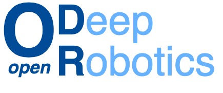

**A modular, open and non-proprietary toolkit for core robotic functionalities by harnessing deep learning**
______________________________________________________________________

  <a href="https://www.opendr.eu/">Website</a> •
  <a href="docs/reference/installation.md">Installation</a> •
  <a href="projects/python">Python Examples</a> •
  <a href="projects/opendr_ws">ROS1</a> •
  <a href="projects/opendr_ws_2">ROS2</a> •
  <a href="projects/c_api">C API</a> •
  <a href="docs/reference/customize.md">Customization</a> •
  <a href="docs/reference/issues.md">Known Issues</a> •
  <a href="#roadmap">Roadmap</a> •
  <a href="CHANGELOG.md">Changelog</a> •
  <a href="LICENSE">License</a>

## About

The aim of [OpenDR Project](https://opendr.eu) is to develop a **modular, open** and **non-proprietary toolkit** for core **robotic functionalities** by harnessing **deep learning** to provide advanced perception and cognition capabilities, meeting in this way the general requirements of robotics applications in the applications areas of healthcare, agri-food and agile production.
OpenDR provides the means to link the **robotics applications to software libraries** (deep learning frameworks, e.g., [PyTorch](https://pytorch.org/) and [Tensorflow](https://www.tensorflow.org/)) to the **operating environment ([ROS](https://www.ros.org/))**.
OpenDR focuses on the **AI and Cognition core technology** in order to provide tools that make robotic systems cognitive, giving them the ability to:
1. interact with people and environments by developing deep learning methods for **human centric and environment active perception and cognition**,
2. **learn and categorize** by developing deep learning **tools for training and inference in common robotics settings**, and
3. **make decisions and derive knowledge** by developing deep learning tools for cognitive robot action and decision making.

As a result, the developed OpenDR toolkit will also enable cooperative human-robot interaction as well as the development of cognitive mechatronics where sensing and actuation are closely coupled with cognitive systems thus contributing to another two core technologies beyond AI and Cognition.
OpenDR aims to develop, train, deploy and evaluate deep learning models that improve the technical capabilities of the core technologies beyond the current state of the art.

## Where to start?

You can start by [installing](docs/reference/installation.md) the OpenDR toolkit.
OpenDR can be installed in the following ways:
1. By *cloning* this repository (CPU/GPU support)
2. Using *pip* (CPU/GPU support only)
3. Using *docker* (CPU/GPU support)

## What OpenDR provides?

OpenDR provides an intuitive and easy to use **[Python interface](src/opendr)**, a **[C API](src/c_api) for performance critical application**, a wealth of **[usage examples and supporting tools](projects)**, as well as **ready-to-use [ROS nodes](projects/opendr_ws)**.
OpenDR is built to support [Webots Open Source Robot Simulator](https://cyberbotics.com/), while it also extensively follows industry standards, such as [ONNX model format](https://onnx.ai/) and [OpenAI Gym Interface](https://gym.openai.com/).

## How can I start using OpenDR?

You can find detailed documentation in OpenDR [wiki](https://github.com/opendr-eu/opendr/wiki).
The main point of reference after installing the toolkit is the [tools index](docs/reference/index.md).
Starting from there, you can find detailed documentation for all the tools included in OpenDR.

- If you are interested in ready-to-use ROS nodes, then you can directly jump to our [ROS1](projects/opendr_ws) and [ROS2](projects/opendr_ws_2) workspaces.
- If you are interested for ready-to-use examples, then you can checkout the [projects](projects/python) folder, which contains examples and tutorials for [perception](projects/python/perception), [control](projects/python/control), [simulation](projects/python/simulation) and [hyperparameter tuning](projects/python/utils) tools.
- If you want to explore our C API, then you explore the provided [C demos](projects/c_api).

## How can I interface OpenDR?

OpenDR is built upon Python.
Therefore, the main OpenDR interface is written in Python and it is available through the [opendr](src/opendr) package.
Furthermore, OpenDR provides [ROS1](projects/opendr_ws) and [ROS2](projects/opendr_ws_2) interfaces, as well as a [C interface](projects/c_api).
Note that you can use as many tools as you wish at the same time, since there is no hardware limitation on the number of tools that can run at the same time.
However, hardware limitations (e.g., GPU memory) might restrict the number of tools that can run at any given moment.

## Roadmap
OpenDR has the following roadmap:
- **v1.0 (2021)**: Baseline deep learning tools for core robotic functionalities
- **v2.0 (2022)**: Optimized lightweight and high-resolution deep learning tools for robotics
- **v3.0 (2023)**: Active perception-enabled deep learning tools for improved robotic perception

## How to contribute
Please follow the instructions provided in the [wiki](https://github.com/opendr-eu/opendr/wiki).

## How to cite us
If you use OpenDR for your research, please cite the following paper that introduces OpenDR architecture and design:
<pre>
@inproceedings{opendr2022,
  title={OpenDR: An Open Toolkit for Enabling High Performance, Low Footprint Deep Learning for Robotics},
  author={Passalis, Nikolaos and Pedrazzi, Stefania and Babuska, Robert and Burgard, Wolfram and Dias, Daniel and Ferro, Francesco and Gabbouj, Moncef and Green, Ole and Iosifidis, Alexandros and Kayacan, Erdal and Kober, Jens and Michel, Olivier and Nikolaidis, Nikos and Nousi, Paraskevi and Pieters, Roel and Tzelepi, Maria and Valada, Abhinav and Tefas, Anastasios},
    booktitle = {Proceedings of the 2022 IEEE/RSJ International Conference on Intelligent Robots and Systems (to appear)},
  year={2022}
}
</pre>

## Acknowledgments
*OpenDR project has received funding from the European Union’s Horizon 2020 research and innovation programme under grant agreement No 871449.*

 

