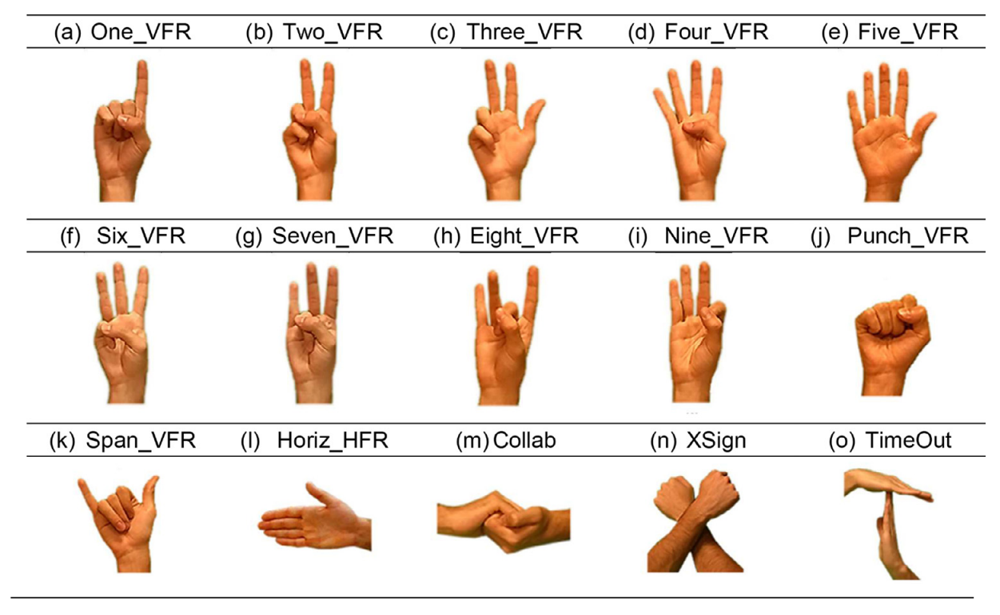

## rgbd_hand_gesture_learner module

The *rgbd_hand_gesture_learner* module contains the *RgbdHandGestureLearner* class, which inherits from the abstract class *Learner*.

On the table below you can find the gesture classes and their corresponding IDs:

| **ID** |    0   |   1   |   2  |   3  |        4       |        5       |   6  |  7  |   8   |   9   |  10 |  11  |   12  |    13   |  14 |   15  |
|:------:|:------:|:-----:|:----:|:----:|:--------------:|:--------------:|:----:|:---:|:-----:|:-----:|:---:|:----:|:-----:|:-------:|:---:|:-----:|
|  Class | COLLAB | Eight | Five | Four | Horiz HBL, HFR | Horiz HFL, HBR | Nine | One | Punch | Seven | Six | Span | Three | TimeOut | Two | XSign |

The naming convention of the gestures classes is as follow:
- V is used for vertical gestures, while H is used for horizontal gestures.
- F identifies the version of the gesture where the front of the hand is facing the camera, while B identifies the version where the back of the hand is facing the camera.
- R is used for right-hand gestures, while L is used for left-hand gestures.

Below is an illustration image of hand gestures, the image is copied from [[1]](#dataset).


### Class RgbdHandGestureLearner 
Bases: `opendr.engine.learners.Learner`

The *RgbdHandGestureLearner* class provides an implementation of the common baseline method in hand gesture recognition using RGBD input, which concantenates the RGB and the depth image into a single image with 4 channels.  
Hand gesture recognition is conducted via learning a convolution neural network (CNN) classifier that operates on the input RGBD data.  
Common CNN architectures are implemented with an option to load their pretrained weights on the ImageNet dataset.   

The [RgbdHandGestureLearner](/src/opendr/perception/multimodal_human_centric/rgbd_hand_gesture_learner/rgbd_hand_gesture_learner.py) class has the following public methods:

#### `RgbdHandGestureLearner` constructor
```python
RgbdHandGestureLearner(self, n_class, architecture, pretrained, lr_scheduler, optimizer, weight_decay, iters, batch_size, n_workers, checkpoint_after_iter, checkpoint_load_iter, temp_path, device, test_mode)
```

**Parameters**:

- **n_class**: *int*  
  Specifies the number of classes.
- **architecture**: *str/torch.nn.Module*  
  Specifies the architecture of the classifier.  
  This can be a string that indicates a built-in architecture or an instance of `torch.nn.Module` that implements a custom architecture.  
  The complete list of built-in classifiers can be retrieved by calling `opendr.perception.multimodal_human_centric.rgbd_hand_gesture_learner.rgb_hand_gesture_learner.get_builtin_architectures()`, which includes:
	- 'mobilenet_v2'
	- 'vgg11'
	- 'vgg11_bn'
	- 'vgg13'
	- 'vgg13_bn'
	- 'vgg16'
	- 'vgg16_bn'
	- 'vgg19'
	- 'vgg19_bn'
	- 'mnasnet0_5'
	- 'mnasnet0_75'
	- 'mnasnet1_0'
	- 'mnasnet1_3'
	- 'densenet121'
	- 'densenet161'
	- 'densenet169'
	- 'densenet201'
	- 'resnet18'
	- 'resnet34'
	- 'resnet50'
	- 'resnet101'
	- 'resnet152'
	- 'resnext50_32x4d'
	- 'resnext101_32x8d'
	- 'wide_resnet50_2'
	- 'wide_resnet101_2'

- **pretrained**: *bool, default=False*   
  Specifies whether to load the ImageNet pretrained weights.  
  Not all architectures have pretrained weights available.  
  The names of architectures that have pretrained weights can be retrieved by calling `opendr.perception.multimodal_human_centric.rgbd_hand_gesture_learner.rgbd_hand_gesture_learner.get_pretrained_architectures()`.  
- **lr_scheduler**: *callable, default= `opendr.perception.multimodal_human_centric.rgbd_hand_gesture_learner.rgbd_hand_gesture_learner.get_cosine_lr_scheduler(1e-3, 1e-5)`*  
  Specifies the function that computes the learning rate, given the total number of epoch `n_epoch` and the current epoch index `epoch_idx`.  
  That is, the optimizer uses this function to determine the learning rate at a given epoch index.  
  Calling `lr_scheduler(n_epoch, epoch_idx)` should return the corresponding learning rate that should be used for the given epoch index.  
  The default `lr_scheduler` implements a schedule that gradually reduces the learning rate from the initial learning rate (0.001) to the final learning rate (0.00001) using cosine function.  
  In order to use the default cosine learning rate scheduler with different initial and final learning rates, the user can use the convenient method `get_cosine_lr_scheduler(initial_lr, final_lr)` from this module, i.e., `opendr.perception.multimodal_human_centric.rgbd_hand_gesture_learner.rgb_hand_gesture_learner.get_cosine_lr_scheduler`.  
  In addition, the convenient method from the same module `get_multiplicative_lr_scheduler(initial_lr, drop_at, multiplication_factor)` allows the user to specify a learning rate schedule that starts with an initial learning rate (`initial_lr`) and reduces the learning rate at certain epochs (specified by the list `drop_at`), using the given `multiplicative_factor`. 
 
- **optimizer**: *{'adam', 'sgd'}, default='adam'*   
  Specifies the name of the optimizer.  
  If 'sgd' is used, momentum is set to 0.9 and nesterov is set to True.  
  
- **weight_decay**: *float, default=1e-4*   
  Specifies the weight decay coefficient.  
  
- **iters**: *int, default=200*  
  Specifies the number of epochs used to the classifier.  
  
- **batch_size**: *int, default=32*   
  Specifies the size of mini-batches.  

- **n_workers**: *int, default=4*   
  Specifies number of threads to be used in data loading. 

- **checkpoint_after_iter**: *int, default=1*  
  Specifies the frequency to save checkpoints.  
  The default behavior saves checkpoint after every epoch.  
  
- **checkpoint_load_iter**: *int, default=0*   
  Specifies the iteration index to load a checkpoint.  
  When `checkpoint_load_iter=0`, the training is done from scratch.   
  When `checkpoint_load_iter=-1`, the training is done from the latest checkpoint.   
  When `checkpoint_load_iter=k` with `k < iters`, the training is done from iteration `k`.   
  Note that this option is only available if `temp_path` argument is specified.  
  
- **temp_path**: *str, default=''*  
  Specifies path to the temporary directory that will be used to save checkpoints.  
  If not empty, this can be used to resume training later from the latest checkpoint.  
  
- **device**: *{'cuda', 'cpu'}, default='cpu'*   
  Specifies the computation device.  
  
- **test_mode**: *bool, default=False*   
  If `test_mode` is True, only a small number of mini-batches is used for each epoch.  
  This option enables rapid testing of the code when training on large datasets.  
  

#### `RgbdHandGestureLearner.fit`
```python
RgbdHandGestureLearner.fit(self, train_set, val_set, test_set, logging_path, silent, verbose)
```

This method is used for training the hand gesture recognition model.  
If validation set is provided, it is used to validate the best model weights during the optimization process.  
That is, the final model weight is the one that produces the best validation accuracy during optimization.  
If validation set is not provided, the final model weight is the one that produces the best training accuracy during optimization. 

Returns a dictionary containing a list of cross entropy measures (dict keys: `"train_cross_entropy"`, `"val_cross_entropy"`, `"test_cross_entropy"`) and a list of accuracy (dict key: `"train_acc"`, `"val_acc"`, `"test_acc"`) during the entire optimization process.  
Note that the last value in the provided lists do not necessarily correspond to the final model performance due to the model selection policy mentioned above.  
To get the final performance on a dataset, please use the `eval` method of `RgbdHandGestureLearner`.  
 
**Parameters**:

  - **train_set**: *engine.datasets.DatasetIterator*   
    Object that holds the training set.  
    OpenDR dataset object, with `__getitem__` producing a pair of (`engine.data.Image`, `engine.target.Category`).  
    The RGBD input must have the following shape: (height, width, 4), with the color and depth channels arranged in R, G, B, D order.   
  - **val_set**: *engine.datasets.DatasetIterator, default=None*    
    Object that holds the validation set.  
    OpenDR dataset object, with `__getitem__` producing a pair of (`engine.data.Image`, `engine.target.Category`).  
    The RGBD input must have the following shape: (height, width, 4), with the color and depth channels arranged in R, G, B, D order.  
    If `val_set` is not `None`, it is used to select the model's weights that produce the best validation accuracy.  
  - **test_set**: *engine.datasets.DatasetIterator, default=None*    
    Object that holds the test set.  
    OpenDR dataset object, with `__getitem__` producing a pair of (`engine.data.Image`, `engine.target.Category`).  
    The RGBD input must have the following shape: (height, width, 4), with the color and depth channels arranged in R, G, B, D order.  
  - **logging_path**: *str, default=''*     
    Tensorboard path.  
    If not empty, tensorboard data is saved to this path.  
  - **silent**: *bool, default=False*     
    If set to True, disables all printing, otherwise, the performance statistics, estimated time till finish are printed to STDOUT after every epoch.  
  - **verbose**: *bool, default=True*   
    If set to True, enables the progress bar of each epoch.  
 
**Returns**:

  - **performance**: *dict*  
    A dictionary that holds the lists of performance curves with the following keys: `"train_acc"`, `"train_cross_entropy"`, `"val_acc"`, `"val_cross_entropy"`, `"test_acc"`, `"test_cross_entropy"`.    


#### `RgbdHandGestureLearner.eval`   
```python
RgbdHandGestureLearner.eval(self, dataset, silent, verbose)
```

This method is used to evaluate the current hand gesture recognition model given a dataset.  
 
**Parameters**:

- **dataset**: *engine.datasets.DatasetIterator*   
  Object that holds the training set.  
  OpenDR dataset object, with `__getitem__` producing a pair of (`engine.data.Image`, `engine.target.Category`).   
  The RGBD input must have the following shape: (height, width, 4), with the color and depth channels arranged in R, G, B, D order.  
- **silent**: *bool, default=False*     
  If set to False, print the cross entropy and accuracy to STDOUT.  
- **verbose**: *bool, default=True*   
  If set to True, display a progress bar of the evaluation process. 
 
**Returns**:

- **performance**: *dict*  
  Dictionary that contains `"cross_entropy"` and `"acc"` as keys.  


#### `RgbdHandGestureLearner.infer`  
```python
RgbdHandGestureLearner.infer(img)
```

This method is used to generate the hand gesture prediction given an RGBD image.  
Returns an instance of `engine.target.Category` representing the prediction.  

**Parameters**:

- **img**: *engine.data.Image*  
  Object of type `engine.data.Image` that holds the input data. 
  The RGBD image must have the following shape: (height, width, 4), with the color and depth channels arraged in R, G, B, D order.   
 
**Returns**:

- **prediction**: *engine.target.Category*  
  Object of type `engine.target.Category` that contains the prediction.  


#### `RgbdHandGestureLearner.save`  
```python
RgbdHandGestureLearner.save(path, verbose)
```

This method is used to save the current model instance under a given path.  
The saved model can be loaded later by calling `RgbHandGestureLearner.load(path)`.   
Two files are saved under the given directory path, namely `"path/metadata.json"` and `"path/model_weights.pt"`.  
The former keeps the metadata and the latter keeps the model weights.   

**Parameters**:

- **path**: *str*    
  Directory path to save the model.   
- **verbose**: *bool, default=True*   
  If set to True, print acknowledge message when saving is successful.   
  

#### `RgbdHandGestureLearner.load`  
```python
RgbdHandGestureLearner.load(path, verbose)  
```

This method is used to load a previously saved model (by calling `RgbdHandGestureLearner.save(path)`) from a given directory.  
Note that under the given directory path, `"metadata.json"` and `"model_weights.pt"` must exist.   

**Parameters**:

- **path**: *str*  
  Directory path of the model to be loaded.  
- **verbose**: *bool, default=True*  
  If set to True, print acknowledge message when model loading is successful.  

#### `RgbdHandGestureLearner.download`
```python
RgbdHandGestureLearner.download(path)
```

This method is used to download the pretrained hand gesture model for the `mobilenet_v2` architecture.   
In order to use this pretrained model, the input RGBD image should be resized to 224x224.   
The RGB channels should be scaled to the range [0, 1] before being standardized with `mean = [0.485, 0.456, 0.406]` and `std = [0.229, 0.224, 0.225]`.   
The depth channel should be scaled to the range [0, 1] by dividing by the largest value in its representation before being standardized with `mean = 0.0303` and `std = 0.0353`.   
For example, a depth image represented in uint16 should be divided by 65535 before the standardization step.  

**Parameters**:
  
- **path**: *str*   
  Directory path to download the model.   
  Under this path, `"metadata.json"` and `"model_weights.pt"` will be downloaded.  
  The weights of the downloaded pretrained model can be loaded by calling `RgbdHandGestureLearner.load(path)` afterward.   

#### `opendr.perception.multimodal_human_centric.rgbd_hand_gesture_learner.rgbd_hand_gesture_learner.get_hand_gesture_dataset`
```python
opendr.perception.multimodal_human_centric.rgbd_hand_gesture_learner.rgbd_hand_gesture_learner.get_hand_gesture_dataset(path, resolution)
```

This method is used to get the training and validation sets of the hand gesture dataset [[1]](#dataset) that are ready to be used with the `fit()` method.  
If the dataset is not available under the given path, it will be downloaded and preprocessed.  

**Parameters**:
  
- **path**: *str*   
  Specifies the directory path where the dataset resides.  
  If the dataset does not exist under the given path, it will be downloaded and saved under `path/hand_gestures`.    
- **resolution**: *int, default=224*   
  Specifies the resolution in which the images will be resized.  

**Returns**:

- **train_set**: *opendr.engine.datasets.DatasetIterator*   
  The training set object that can be used with the `fit()` method to train the hand gesture classifier.   
- **val_set**: *opendr.engine.datasets.DatasetIterator*   
  The validation set object that can be used with the `fit()` method to train the hand gesture classifier.   
- **n_class**: *int*  
  The number of hand gestures in this dataset.  
- **text_labels**: *list[str]*  
  The list of textual labels of the hand gestures.   
  If the prediction from the model is `k`, the textual description of hand gesture is `text_labels[k]`.   


### Examples

* **Training an RGBD hand gesture recognition model**.  
  In this example, we will train a hand gesture classifier using the data provided by [[1]](#dataset).  
  The training and validation data object can be constructed easily by using our convenient method `get_hand_gesture_dataset()` as follows:   

  ```python
  from opendr.perception.multimodal_human_centric.rgbd_hand_gesture_learner.rgbd_hand_gesture_learner import RgbdHandGestureLearner, get_hand_gesture_dataset 

  # download the dataset to the current directory
  train_set, val_set, n_class, text_labels = get_hand_gesture_dataset('.')
  ```

  Then, we can construct the classifier having the `densenet121` architecture with the pretrained ImageNet weights, and train the learner for 300 iterations as follows:  

  ```python
  learner = RgbdHandGestureLearner(n_class=n_class, architecture='densenet121', pretrained=True, iters=300)
  performance = learner.fit(train_set, val_set)
  ```

* **Using pretrained hand gesture recognition model**.  
  In this example, we will demonstrate how a pretrained hand gesture recognition model can be easily downloaded and used.   
  At the moment, only a light-weight pretrained `mobilenet_v2` is provided so we will create a learner instance with `mobilenet_v2` as the architecture.  

   ```python
  from opendr.perception.multimodal_human_centric.rgbd_hand_gesture_learner.rgbd_hand_gesture_learner import RgbdHandGestureLearner 

  learner = RgbdHandGestureLearner(n_class=16, architecture='mobilenet_v2')
  ```

  In the above snippet, since the pretrained model was trained using a set of 16 static hand gestures provided in [[1]](#dataset), the number of classes `n_class` is set to 16.  
  After creating the model instance, we will download the model to the current directory using the `download()` method and load the pretrained weights using the `load()` method.  

  ```python
  learner.download('./mobilenet_v2')
  learner.load('./mobilenet_v2')
  ```

  Given an RGB image `"input_rgb.png"` (saved as uint8) and the corresponding depth map saved as `"input_depth.png"` (saved as uint16), we can preprocess the images and make inference using the pretrained model as follows:

  ```python
  # import the necessary modules to read and preprocess the images
  import imageio, numpy as np, cv2 
  from opendr.engine.data import Image

  # read rgb and depth image
  rgb_img = imageio.imread('input_rgb.png') 
  depth_img = imageio.imread('input_depth.png') 

  # scale the rgb and depth image
  rgb_img = np.asarray(rgb_img) / (2**8 - 1)
  depth_img = np.asarray(depth_img) / (2**16 - 1)

  # resize the images to 224x224
  rgb_img = cv2.resize(rgb_img, (224, 224))
  depth_img = cv2.resize(depth_img, (224, 224))

  # concatenate and standardize
  img = np.concatenate([rgb_img, np.expand_dims(depth_img, axis=-1)], axis=-1) 
  mean = np.asarray([0.485, 0.456, 0.406, 0.0303]).reshape(1, 1, 4)
  std = np.asarray([0.229, 0.224, 0.225, 0.0353]).reshape(1, 1, 4)
  img = (img - mean) / std

  # wrap the input under Image 
  img = Image(img, dtype=np.float32)

  # make inference 
  prediction = learner.infer(img)
  ```
    
#### References
<a name="dataset" href="https://www.sciencedirect.com/science/article/pii/S2352340921000755">[1]</a> HANDS: an RGB-D dataset of static hand-gestures for human-robot interaction.  
