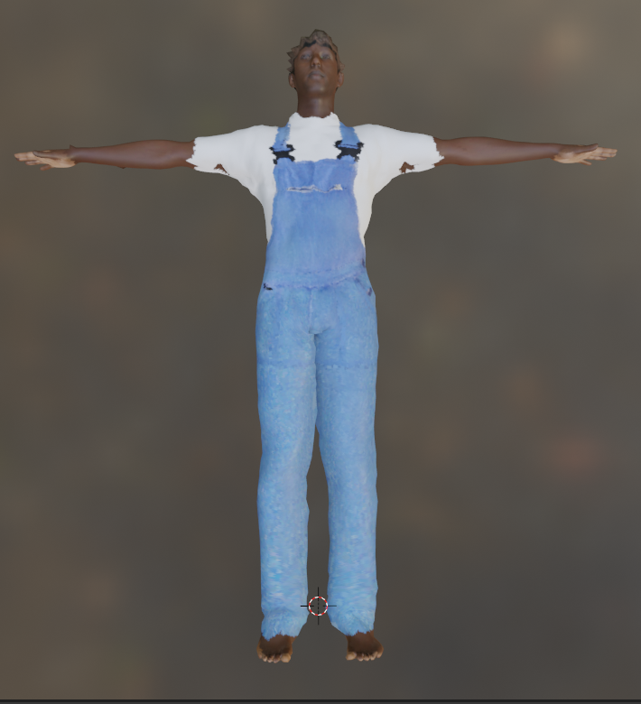
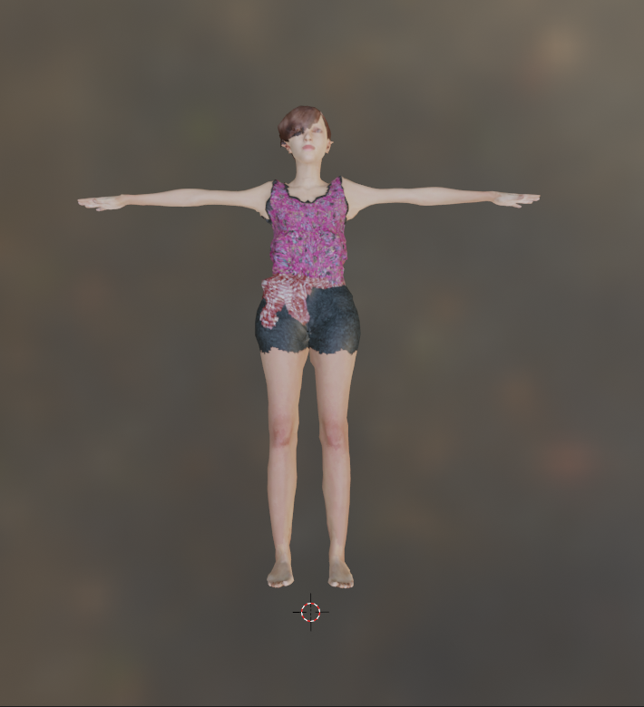
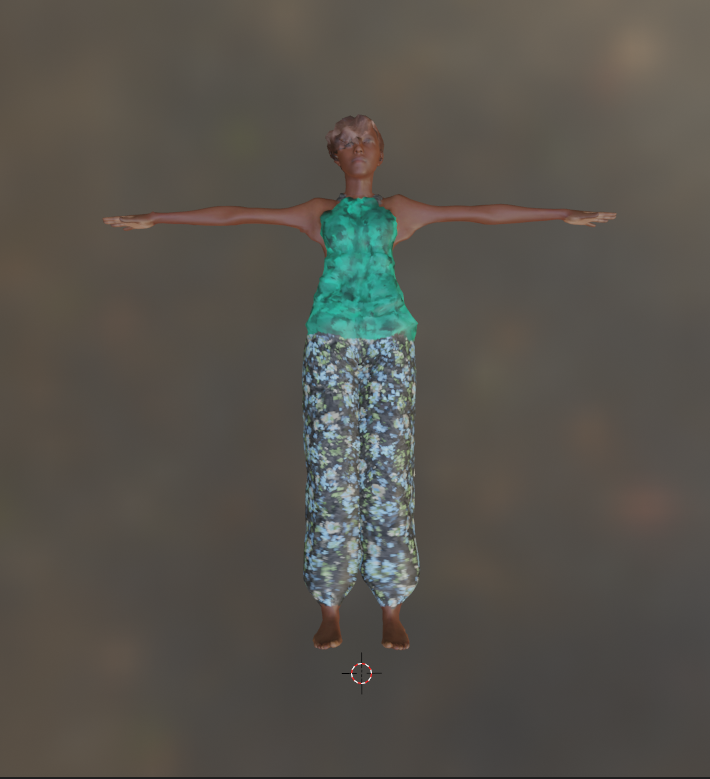
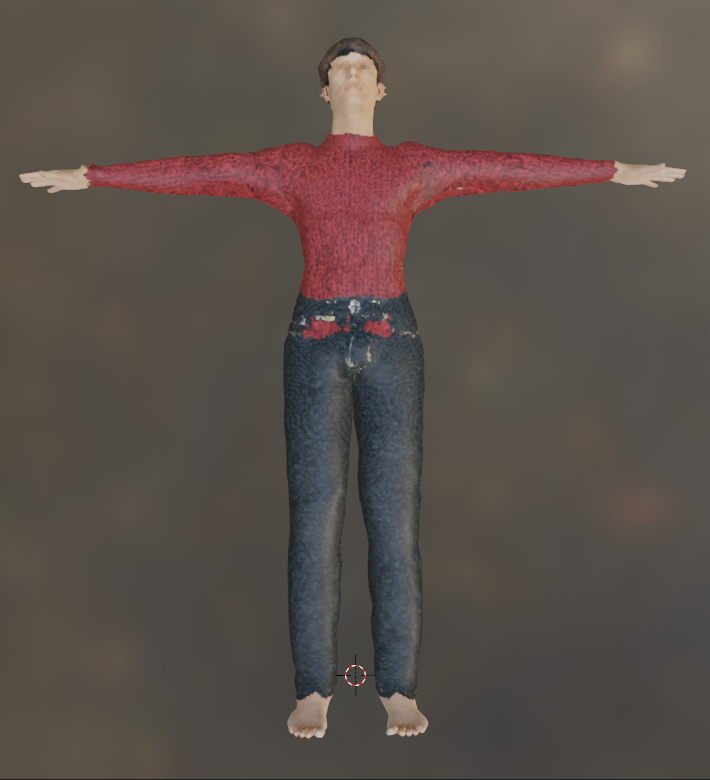

# SMPL+D Human Models

This folder contains code for:
- generating a large number of human models in SMPL+D body model format as FBX files
- importing and animating the human models in Webots for simulations.
<br> 

<p float="left">
  
  
  
  
</p>

### Download the raw SMPL+D models only (≈12.5Gb)

[SMPL](https://files.is.tue.mpg.de/black/papers/SMPL2015.pdf) is a parametric statistical body shape model. SMPL+D is an extension of SMPL, which can encode shape deformations from clothes and hair as vertex displacements. Our dataset contains more that 3200 human models in various shapes and textures. At its core, our dataset is consisted of more than 200 unique SMPL+D models, which were generated through non-rigid shape registration of [MakeHuman](https://www.google.com/search?channel=fs&client=ubuntu&q=makehuman) models. The rest were generated by applying shape and texture deformations to those models. For each human model in our dataset, we provide its corresponding:

- Gender
- Shape Parameters (betas)
- Texture Map
- Displacement Map

All those data can be used directly for research purposes, such as for training methods for shape and texture reconstruction. 

```
python3 download_data.py raw
```

### Download the SMPL+D models and convert them to FBX (Filmbox) (≈12.5Gb)

**Note:** in this case the pose-dependant deformations are not applied.

In addition, we provide code for converting those human models in the FBX format. This format is supported by a wide range of simulation engines, including Webots. However, pose-dependent deformations are not applied to the human models. To convert those models to the FBX format, the original SMPL body model must be downloaded from the authors website.

- Download the data by running:
```
python3 src/download_data.py
```

- Download SMPL for Unity from the official website [here](https://smpl.is.tue.mpg.de/). Once you agree on SMPL license terms and have access to downloads, you will have the following two files:
```
SMPL_f_unityDoubleBlends_lbs_10_scale5_207_v1.0.0.fbx
SMPL_m_unityDoubleBlends_lbs_10_scale5_207_v1.0.0.fbx
```
- Place these two files in the ```model``` directory.

- Download and install Blender (tested on 2.93.4 version)

- Set the path to Blender.
```
export BLENDER_PATH=path_to_Blender
```
- Install the necessary packages to Blender's Python using pip (example using Blender 2.93 and Python 3.9):
```
$BLENDER_PATH/2.93/python/bin/python3.9 -m ensurepip
$BLENDER_PATH/2.93/python/bin/python3.9 -m pip install numpy opencv-python opencv-contrib-python scipy tqdm
```
- Generate the human models as FBX files. 
```
$BLENDER_PATH/blender -P src/generate_models.py
```

### Install a demo Webots project for animating SMPL+D models

**Note:** FBX models must have been previously generated

Finally, instructions for setting a demo project in Webots are provided. In the project, one the SMPL+D models in FBX format can perform an animation from  [AMASS](https://smpl.is.tue.mpg.de/).

-  Download ACCAD database from AMASS (https://amass.is.tue.mpg.de/download.php)

-  Extract the database (e.g., tar -xf ACCAD) 
-  Run:
```
python3 webots/extract_anims.py path_to_database
```
-  Assign the directory of the selected animation in the controllerArgs to webots/smpl_webots/worlds/demo_world.wbt
-  Install the demo project in Webots
```
chmod +x webots/install_project.sh
bash webots/install_project.sh
```

 <em> Part of this work was conducted by Dimitrios Taskoudis for his Master Degree Thesis. </em>
