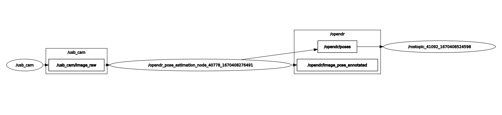

# OpenDR Perception Package

This package contains ROS nodes related to the perception package of OpenDR.

---

## Prerequisites

Before you can run any of the package's ROS nodes, some prerequisites need to be fulfilled:
1. First of all, you need to [set up the required packages, build and source your workspace.](../../README.md#first-time-setup)
2. Start roscore by running `roscore &`, if you haven't already done so.
3. _(Optional for nodes with [RGB input](#rgb-input-nodes))_

    For basic usage and testing, all the toolkit's ROS nodes that use RGB images are set up to expect input from a basic webcam using the default package `usb_cam`, which is installed with the toolkit.
    You can run the webcam node in the terminal with the workspace sourced using:
    ```shell
    rosrun usb_cam usb_cam_node &
    ```
    By default, the USB cam node publishes images on `/usb_cam/image_raw` and the RGB input nodes subscribe to this topic if not provided with an input topic argument.
    As explained for each node below, you can modify the topics via arguments, so if you use any other node responsible for publishing images, **make sure to change the input topic accordingly.**

---

## Notes

- ### Display output images with rqt_image_view
    For any node that outputs images, `rqt_image_view` can be used to display them by running the following command:
    ```shell
    rosrun rqt_image_view rqt_image_view &
    ```
    A window will appear, where the topic that you want to view can be selected from the drop-down menu on the top-left area of the window.
    Refer to each node's documentation below to find out the default output image topic, where applicable, and select it on the drop-down menu of rqt_image_view.

- ### Echo node output
    All OpenDR nodes publish some kind of detection message, which can be echoed by running the following command:
    ```shell
    rostopic echo /opendr/topic_name
    ```
    You can find out the default topic name for each node, in its documentation below.

- ### Increase performance by disabling output
    Optionally, nodes can be modified via command line arguments, which are presented for each node separately below.
    Generally, arguments give the option to change the input and output topics, the device the node runs on (CPU or GPU), etc.
    When a node publishes on several topics, where applicable, a user can opt to disable one or more of the outputs by providing `None` in the corresponding output topic.
    This disables publishing on that topic, forgoing some operations in the node, which might increase its performance.

    _An example would be to disable the output annotated image topic in a node when visualization is not needed and only use the detection message in another node, thus eliminating the OpenCV operations._

- ### An example diagram of OpenDR nodes running
    
    - On the left, the `usb_cam` node can be seen, which is using a system camera to publish images on the `/usb_cam/image_raw` topic.
    - In the middle, OpenDR's pose estimation node is running taking as input the published image. By default, the node has its input topic set to `/usb_cam/image_raw`.
    - To the right the two output topics of the pose estimation node can be seen.
    The bottom topic `/opendr/image_pose_annotated` is the annotated image which can be easily viewed with `rqt_image_view` as explained earlier.
    The other topic `/opendr/poses` is the detection message which contains the detected poses' detailed information.
    This message can be easily viewed by running `rostopic echo /opendr/poses` in a terminal with the OpenDR ROS workspace sourced.

<!-- - ### Other notes -->

----
## RGB input nodes

### Pose Estimation ROS Node

You can find the pose estimation ROS node python script [here](./scripts/pose_estimation_node.py) to inspect the code and modify it as you wish to fit your needs.
The node makes use of the toolkit's [pose estimation tool](../../../../src/opendr/perception/pose_estimation/lightweight_open_pose/lightweight_open_pose_learner.py) whose documentation can be found [here](../../../../docs/reference/lightweight-open-pose.md).
The node publishes the detected poses in [OpenDR's 2D pose message format](../opendr_bridge/msg/OpenDRPose2D.msg), which saves a list of [OpenDR's keypoint message format](../opendr_bridge/msg/OpenDRPose2DKeypoint.msg).

#### Instructions for basic usage:

1. Start the node responsible for publishing images. If you have a USB camera, then you can use the `usb_cam_node` as explained in the [prerequisites above](#prerequisites).

2. You are then ready to start the pose detection node:
    ```shell
    rosrun opendr_perception pose_estimation_node.py
    ```
    The following optional arguments are available:
   - `-h or --help`: show a help message and exit
   - `-i or --input_rgb_image_topic INPUT_RGB_IMAGE_TOPIC`: topic name for input RGB image (default=`/usb_cam/image_raw`)
   - `-o or --output_rgb_image_topic OUTPUT_RGB_IMAGE_TOPIC`: topic name for output annotated RGB image, `None` to stop the node from publishing on this topic (default=`/opendr/image_pose_annotated`)
   - `-d or --detections_topic DETECTIONS_TOPIC`: topic name for detection messages, `None` to stop the node from publishing on this topic (default=`/opendr/poses`)
   - `--device DEVICE`: device to use, either `cpu` or `cuda`, falls back to `cpu` if GPU or CUDA is not found (default=`cuda`)
   - `--accelerate`: acceleration flag that causes pose estimation to run faster but with less accuracy

3. Default output topics:
   - Output images: `/opendr/image_pose_annotated`
   - Detection messages: `/opendr/poses`

   For viewing the output, refer to the [notes above.](#notes)

### Fall Detection ROS Node

You can find the fall detection ROS node python script [here](./scripts/fall_detection_node.py) to inspect the code and modify it as you wish to fit your needs.
The node makes use of the toolkit's [fall detection tool](../../../../src/opendr/perception/fall_detection/fall_detector_learner.py) whose documentation can be found [here](../../../../docs/reference/fall-detection.md).
Fall detection uses the toolkit's pose estimation tool internally.

<!-- TODO Should add information about taking advantage of the pose estimation ros node when running fall detection, see issue https://github.com/opendr-eu/opendr/issues/282 -->

#### Instructions for basic usage:

1. Start the node responsible for publishing images. If you have a USB camera, then you can use the `usb_cam_node` as explained in the [prerequisites above](#prerequisites).

2. You are then ready to start the fall detection node:

    ```shell
    rosrun opendr_perception fall_detection_node.py
    ```
    The following optional arguments are available:
   - `-h or --help`: show a help message and exit
   - `-i or --input_rgb_image_topic INPUT_RGB_IMAGE_TOPIC`: topic name for input RGB image (default=`/usb_cam/image_raw`)
   - `-o or --output_rgb_image_topic OUTPUT_RGB_IMAGE_TOPIC`: topic name for output annotated RGB image, `None` to stop the node from publishing on this topic (default=`/opendr/image_fallen_annotated`)
   - `-d or --detections_topic DETECTIONS_TOPIC`: topic name for detection messages, `None` to stop the node from publishing on this topic (default=`/opendr/fallen`)
   - `--device DEVICE`: device to use, either `cpu` or `cuda`, falls back to `cpu` if GPU or CUDA is not found (default=`cuda`)
   - `--accelerate`: acceleration flag that causes pose estimation that runs internally to run faster but with less accuracy

3. Default output topics:
   - Output images: `/opendr/image_fallen_annotated`
   - Detection messages: `/opendr/fallen`

   For viewing the output, refer to the [notes above.](#notes)

### Face Detection ROS Node

The face detection ROS node supports both the ResNet and MobileNet versions, the latter of which performs masked face detection as well.

You can find the face detection ROS node python script [here](./scripts/face_detection_retinaface_node.py) to inspect the code and modify it as you wish to fit your needs.
The node makes use of the toolkit's [face detection tool](../../../../src/opendr/perception/object_detection_2d/retinaface/retinaface_learner.py) whose documentation can be found [here](../../../../docs/reference/face-detection-2d-retinaface.md).

#### Instructions for basic usage:

1. Start the node responsible for publishing images. If you have a USB camera, then you can use the `usb_cam_node` as explained in the [prerequisites above](#prerequisites).

2. You are then ready to start the face detection node

    ```shell
    rosrun opendr_perception face_detection_retinaface_node.py
    ```
    The following optional arguments are available:
   - `-h or --help`: show a help message and exit
   - `-i or --input_rgb_image_topic INPUT_RGB_IMAGE_TOPIC`: topic name for input RGB image (default=`/usb_cam/image_raw`)
   - `-o or --output_rgb_image_topic OUTPUT_RGB_IMAGE_TOPIC`: topic name for output annotated RGB image, `None` to stop the node from publishing on this topic (default=`/opendr/image_faces_annotated`)
   - `-d or --detections_topic DETECTIONS_TOPIC`: topic name for detection messages, `None` to stop the node from publishing on this topic (default=`/opendr/faces`)
   - `--device DEVICE`: device to use, either `cpu` or `cuda`, falls back to `cpu` if GPU or CUDA is not found (default=`cuda`)
   - `--backbone BACKBONE`: retinaface backbone, options are either `mnet` or `resnet`, where `mnet` detects masked faces as well (default=`resnet`)

3. Default output topics:
   - Output images: `/opendr/image_faces_annotated`
   - Detection messages: `/opendr/faces`

   For viewing the output, refer to the [notes above.](#notes)

### Face Recognition ROS Node

You can find the face recognition ROS node python script [here](./scripts/face_recognition_node.py) to inspect the code and modify it as you wish to fit your needs.
The node makes use of the toolkit's [face recognition tool](../../../../src/opendr/perception/face_recognition/face_recognition_learner.py) whose documentation can be found [here](../../../../docs/reference/face-recognition.md).

#### Instructions for basic usage:

1. Start the node responsible for publishing images. If you have a USB camera, then you can use the `usb_cam_node` as explained in the [prerequisites above](#prerequisites).

2. You are then ready to start the face recognition node:

    ```shell
    rosrun opendr_perception face_recognition_node.py
    ```
    The following optional arguments are available:
   - `-h or --help`: show a help message and exit
   - `-i or --input_rgb_image_topic INPUT_RGB_IMAGE_TOPIC`: topic name for input RGB image (default=`/usb_cam/image_raw`)
   - `-o or --output_rgb_image_topic OUTPUT_RGB_IMAGE_TOPIC`: topic name for output annotated RGB image, `None` to stop the node from publishing on this topic (default=`/opendr/image_face_reco_annotated`)
   - `-d or --detections_topic DETECTIONS_TOPIC`: topic name for detection messages, `None` to stop the node from publishing on this topic (default=`/opendr/face_recognition`)
   - `-id or --detections_id_topic DETECTIONS_ID_TOPIC`: topic name for detection ID messages, `None` to stop the node from publishing on this topic (default=`/opendr/face_recognition_id`)
   - `--device DEVICE`: device to use, either `cpu` or `cuda`, falls back to `cpu` if GPU or CUDA is not found (default=`cuda`)
   - `--backbone BACKBONE`: backbone network (default=`mobilefacenet`)
   - `--dataset_path DATASET_PATH`: path of the directory where the images of the faces to be recognized are stored (default=`./database`)

3. Default output topics:
   - Output images: `/opendr/image_face_reco_annotated`
   - Detection messages: `/opendr/face_recognition` and `/opendr/face_recognition_id`

   For viewing the output, refer to the [notes above.](#notes)

**Notes**

Reference images should be placed in a defined structure like:
- imgs
    - ID1
      - image1
      - image2
    - ID2
    - ID3
    - ...

The default dataset path is `./database`. Please use the `--database_path ./your/path/` argument to define a custom one.
Τhe name of the sub-folder, e.g. ID1, will be published under `/opendr/face_recognition_id`.

The database entry and the returned confidence is published under the topic name `/opendr/face_recognition`, and the human-readable ID
under `/opendr/face_recognition_id`.

### 2D Object Detection ROS Nodes

For 2D object detection, there are several ROS nodes implemented using various algorithms. The generic object detectors are SSD, YOLOv3, YOLOv5, CenterNet, Nanodet and DETR.

You can find the 2D object detection ROS node python scripts here:
[SSD node](./scripts/object_detection_2d_ssd_node.py), [YOLOv3 node](./scripts/object_detection_2d_yolov3_node.py), [YOLOv5 node](./scripts/object_detection_2d_yolov5_node.py), [CenterNet node](./scripts/object_detection_2d_centernet_node.py), [Nanodet node](./scripts/object_detection_2d_nanodet_node.py) and [DETR node](./scripts/object_detection_2d_detr_node.py),
where you can inspect the code and modify it as you wish to fit your needs.
The nodes makes use of the toolkit's various 2D object detection tools:
[SSD tool](../../../../src/opendr/perception/object_detection_2d/ssd/ssd_learner.py), [YOLOv3 tool](../../../../src/opendr/perception/object_detection_2d/yolov3/yolov3_learner.py), [YOLOv5 tool](../../../../src/opendr/perception/object_detection_2d/yolov5/yolov5_learner.py),
[CenterNet tool](../../../../src/opendr/perception/object_detection_2d/centernet/centernet_learner.py), [Nanodet tool](../../../../src/opendr/perception/object_detection_2d/nanodet/nanodet_learner.py), [DETR tool](../../../../src/opendr/perception/object_detection_2d/detr/detr_learner.py),
whose documentation can be found here:
[SSD docs](../../../../docs/reference/object-detection-2d-ssd.md), [YOLOv3 docs](../../../../docs/reference/object-detection-2d-yolov3.md), [YOLOv5 docs](../../../../docs/reference/object-detection-2d-yolov5.md),
[CenterNet docs](../../../../docs/reference/object-detection-2d-centernet.md), [Nanodet docs](../../../../docs/reference/nanodet.md), [DETR docs](../../../../docs/reference/detr.md).

#### Instructions for basic usage:

1. Start the node responsible for publishing images. If you have a USB camera, then you can use the `usb_cam_node` as explained in the [prerequisites above](#prerequisites).

2. You are then ready to start a 2D object detector node:
   1. SSD node
      ```shell
      rosrun opendr_perception object_detection_2d_ssd_node.py
      ```
      The following optional arguments are available for the SSD node:
      - `--backbone BACKBONE`: Backbone network (default=`vgg16_atrous`)
      - `--nms_type NMS_TYPE`: Non-Maximum Suppression type options are `default`, `seq2seq-nms`, `soft-nms`, `fast-nms`, `cluster-nms` (default=`default`)

   2. YOLOv3 node
      ```shell
      rosrun opendr_perception object_detection_2d_yolov3_node.py
      ```
      The following optional argument is available for the YOLOv3 node:
      - `--backbone BACKBONE`: Backbone network (default=`darknet53`)

   3. YOLOv5 node
      ```shell
      rosrun opendr_perception object_detection_2d_yolov5_node.py
      ```
      The following optional argument is available for the YOLOv5 node:
      - `--model_name MODEL_NAME`: Network architecture, options are `yolov5s`, `yolov5n`, `yolov5m`, `yolov5l`, `yolov5x`, `yolov5n6`, `yolov5s6`, `yolov5m6`, `yolov5l6`, `custom` (default=`yolov5s`)

   4. CenterNet node
      ```shell
      rosrun opendr_perception object_detection_2d_centernet_node.py
      ```
      The following optional argument is available for the CenterNet node:
      - `--backbone BACKBONE`: Backbone network (default=`resnet50_v1b`)

   5. Nanodet node
      ```shell
      rosrun opendr_perception object_detection_2d_nanodet_node.py
      ```
      The following optional argument is available for the Nanodet node:
      - `--model Model`: Model that config file will be used (default=`plus_m_1.5x_416`)

   6. DETR node
      ```shell
      rosrun opendr_perception object_detection_2d_detr_node.py
      ```

   The following optional arguments are available for all nodes above:
   - `-h or --help`: show a help message and exit
   - `-i or --input_rgb_image_topic INPUT_RGB_IMAGE_TOPIC`: topic name for input RGB image (default=`/usb_cam/image_raw`)
   - `-o or --output_rgb_image_topic OUTPUT_RGB_IMAGE_TOPIC`: topic name for output annotated RGB image, `None` to stop the node from publishing on this topic (default=`/opendr/image_objects_annotated`)
   - `-d or --detections_topic DETECTIONS_TOPIC`: topic name for detection messages, `None` to stop the node from publishing on this topic (default=`/opendr/objects`)
   - `--device DEVICE`: Device to use, either `cpu` or `cuda`, falls back to `cpu` if GPU or CUDA is not found (default=`cuda`)

3. Default output topics:
   - Output images: `/opendr/image_objects_annotated`
   - Detection messages: `/opendr/objects`

   For viewing the output, refer to the [notes above.](#notes)

### 2D Single Object Tracking ROS Node

You can find the single object tracking 2D ROS node python script [here](./scripts/object_tracking_2d_siamrpn_node.py) to inspect the code and modify it as you wish to fit your needs.
The node makes use of the toolkit's [single object tracking 2D SiamRPN tool](../../../../src/opendr/perception/object_tracking_2d/siamrpn/siamrpn_learner.py) whose documentation can be found [here](../../../../docs/reference/object-tracking-2d-siamrpn.md).

#### Instructions for basic usage:

1. Start the node responsible for publishing images. If you have a USB camera, then you can use the `usb_cam_node` as explained in the [prerequisites above](#prerequisites).

2. You are then ready to start the single object tracking 2D node:

    ```shell
    rosrun opendr_perception object_tracking_2d_siamrpn_node.py
    ```

    The following optional arguments are available:
   - `-h or --help`: show a help message and exit
   - `-i or --input_rgb_image_topic INPUT_RGB_IMAGE_TOPIC` : listen to RGB images on this topic (default=`/usb_cam/image_raw`)
   - `-o or --output_rgb_image_topic OUTPUT_RGB_IMAGE_TOPIC`: topic name for output annotated RGB image, `None` to stop the node from publishing on this topic (default=`/opendr/image_tracking_annotated`)
   - `-t or --tracker_topic TRACKER_TOPIC`: topic name for tracker messages, `None` to stop the node from publishing on this topic (default=`/opendr/tracked_object`)
   - `--device DEVICE`: Device to use, either `cpu` or `cuda`, falls back to `cpu` if GPU or CUDA is not found (default=`cuda`)

3. Default output topics:
   - Output images: `/opendr/image_tracking_annotated`
   - Detection messages: `/opendr/tracked_object`

   For viewing the output, refer to the [notes above.](#notes)

**Notes**

To initialize this node it is required to provide a bounding box of an object to track.
This is achieved by initializing one of the toolkit's 2D object detectors (YOLOv3) and running object detection once on the input.
Afterwards, **the detected bounding box that is closest to the center of the image** is used to initialize the tracker. 
Feel free to modify the node to initialize it in a different way that matches your use case.

### 2D Object Tracking ROS Nodes

For 2D object tracking, there two ROS nodes provided, one using Deep Sort and one using FairMOT which use either pretrained models, or custom trained models.
The predicted tracking annotations are split into two topics with detections and tracking IDs. Additionally, an annotated image is generated.

You can find the 2D object detection ROS node python scripts here: [Deep Sort node](./scripts/object_tracking_2d_deep_sort_node.py) and [FairMOT node](./scripts/object_tracking_2d_fair_mot_node.py)
where you can inspect the code and modify it as you wish to fit your needs.
The nodes makes use of the toolkit's [object tracking 2D - Deep Sort tool](../../../../src/opendr/perception/object_tracking_2d/deep_sort/object_tracking_2d_deep_sort_learner.py)
and [object tracking 2D - FairMOT tool](../../../../src/opendr/perception/object_tracking_2d/fair_mot/object_tracking_2d_fair_mot_learner.py)
whose documentation can be found here: [Deep Sort docs](../../../../docs/reference/object-tracking-2d-deep-sort.md), [FairMOT docs](../../../../docs/reference/object-tracking-2d-fair-mot.md).

#### Instructions for basic usage:

1. Start the node responsible for publishing images. If you have a USB camera, then you can use the `usb_cam_node` as explained in the [prerequisites above](#prerequisites).

2. You are then ready to start a 2D object tracking node:
   1. Deep Sort node
      ```shell
      rosrun opendr_perception object_tracking_2d_deep_sort_node.py
      ```
      The following optional argument is available for the Deep Sort node:
      - `-n --model_name MODEL_NAME`: name of the trained model (default=`deep_sort`)
   2. FairMOT node
      ```shell
      rosrun opendr_perception object_tracking_2d_fair_mot_node.py
      ```
      The following optional argument is available for the FairMOT node:
      - `-n --model_name MODEL_NAME`: name of the trained model (default=`fairmot_dla34`)

    The following optional arguments are available for both nodes:
   - `-h or --help`: show a help message and exit
   - `-i or --input_rgb_image_topic INPUT_RGB_IMAGE_TOPIC`: topic name for input RGB image (default=`/usb_cam/image_raw`)
   - `-o or --output_rgb_image_topic OUTPUT_RGB_IMAGE_TOPIC`: topic name for output annotated RGB image, `None` to stop the node from publishing on this topic (default=`/opendr/image_objects_annotated`)
   - `-d or --detections_topic DETECTIONS_TOPIC`: topic name for detection messages, `None` to stop the node from publishing on this topic (default=`/opendr/objects`)
   - `-t or --tracking_id_topic TRACKING_ID_TOPIC`: topic name for tracking ID messages, `None` to stop the node from publishing on this topic (default=`/opendr/objects_tracking_id`)
   - `--device DEVICE`: device to use, either `cpu` or `cuda`, falls back to `cpu` if GPU or CUDA is not found (default=`cuda`)
   - `-td --temp_dir TEMP_DIR`: path to a temporary directory with models (default=`temp`)

3. Default output topics:
   - Output images: `/opendr/image_objects_annotated`
   - Detection messages: `/opendr/objects`
   - Tracking ID messages: `/opendr/objects_tracking_id`

   For viewing the output, refer to the [notes above.](#notes)

**Notes**

An [image dataset node](#image-dataset-ros-node) is also provided to be used along these nodes.
Make sure to change the default input topic of the tracking node if you are not using the USB cam node.

### Vision Based Panoptic Segmentation ROS Node
A ROS node for performing panoptic segmentation on a specified RGB image stream using the [EfficientPS](../../../../src/opendr/perception/panoptic_segmentation/README.md#efficientps-efficient-panoptic-segmentation) network.

You can find the vision based panoptic segmentation (EfficientPS) ROS node python script [here](./scripts/panoptic_segmentation_efficient_ps_node.py) to inspect the code and modify it as you wish to fit your needs.
The node makes use of the toolkit's [panoptic segmentation tool](../../../../src/opendr/perception/panoptic_segmentation/efficient_ps/efficient_ps_learner.py) whose documentation can be found [here](../../../../docs/reference/efficient-ps.md)
and additional information about EfficientPS [here](../../../../src/opendr/perception/panoptic_segmentation/README.md).

#### Instructions for basic usage:

1. Start the node responsible for publishing images. If you have a USB camera, then you can use the `usb_cam_node` as explained in the [prerequisites above](#prerequisites).

2. You are then ready to start the panoptic segmentation node:

    ```shell
    rosrun opendr_perception panoptic_segmentation_efficient_ps_node.py
    ```

    The following optional arguments are available:
   - `-h, --help`: show a help message and exit
   - `-i or --input_rgb_image_topic INPUT_RGB_IMAGE_TOPIC` : listen to RGB images on this topic (default=`/usb_cam/image_raw`)
   - `--checkpoint CHECKPOINT` : download pretrained models [cityscapes, kitti] or load from the provided path (default=`cityscapes`)
   - `-oh or --output_heatmap_topic OUTPUT_RGB_IMAGE_TOPIC`: publish the semantic and instance maps on this topic as `OUTPUT_HEATMAP_TOPIC/semantic` and `OUTPUT_HEATMAP_TOPIC/instance` (default=`/opendr/panoptic`)
   - `-ov or --output_rgb_image_topic OUTPUT_RGB_IMAGE_TOPIC`: publish the panoptic segmentation map as an RGB image on `VISUALIZATION_TOPIC` or a more detailed overview if using the `--detailed_visualization` flag (default=`/opendr/panoptic/rgb_visualization`)
   - `--detailed_visualization`: generate a combined overview of the input RGB image and the semantic, instance, and panoptic segmentation maps and publish it on `OUTPUT_RGB_IMAGE_TOPIC` (default=deactivated)

3. Default output topics:
   - Output images: `/opendr/panoptic/semantic`, `/opendr/panoptic/instance`, `/opendr/panoptic/rgb_visualization`
   - Detection messages: `/opendr/panoptic/semantic`, `/opendr/panoptic/instance`

### Semantic Segmentation ROS Node

You can find the semantic segmentation ROS node python script [here](./scripts/semantic_segmentation_bisenet_node.py) to inspect the code and modify it as you wish to fit your needs.
The node makes use of the toolkit's [semantic segmentation tool](../../../../src/opendr/perception/semantic_segmentation/bisenet/bisenet_learner.py) whose documentation can be found [here](../../../../docs/reference/semantic-segmentation.md).

#### Instructions for basic usage:

1. Start the node responsible for publishing images. If you have a USB camera, then you can use the `usb_cam_node` as explained in the [prerequisites above](#prerequisites).

2. You are then ready to start the semantic segmentation node:

    ```shell
    rosrun opendr_perception semantic_segmentation_bisenet_node.py
    ```
    The following optional arguments are available:
   - `-h or --help`: show a help message and exit
   - `-i or --input_rgb_image_topic INPUT_RGB_IMAGE_TOPIC`: topic name for input RGB image (default=`/usb_cam/image_raw`)
   - `-o or --output_heatmap_topic OUTPUT_HEATMAP_TOPIC`: topic to which we are publishing the heatmap in the form of a ROS image containing class IDs, `None` to stop the node from publishing on this topic (default=`/opendr/heatmap`)
   - `-ov or --output_rgb_image_topic OUTPUT_RGB_IMAGE_TOPIC`: topic to which we are publishing the heatmap image blended with the input image and a class legend for visualization purposes, `None` to stop the node from publishing on this topic (default=`/opendr/heatmap_visualization`)
   - `--device DEVICE`: device to use, either `cpu` or `cuda`, falls back to `cpu` if GPU or CUDA is not found (default=`cuda`)

3. Default output topics:
   - Output images: `/opendr/heatmap`, `/opendr/heatmap_visualization`
   - Detection messages: `/opendr/heatmap`

   For viewing the output, refer to the [notes above.](#notes)

**Notes**

On the table below you can find the detectable classes and their corresponding IDs:

| Class  | Bicyclist | Building | Car | Column Pole | Fence | Pedestrian | Road | Sidewalk | Sign Symbol | Sky | Tree | Unknown |
|--------|-----------|----------|-----|-------------|-------|------------|------|----------|-------------|-----|------|---------|
| **ID** | 0         | 1        | 2   | 3           | 4     | 5          | 6    | 7        | 8           | 9   | 10   | 11      |

### Image-based Facial Emotion Estimation ROS Node

You can find the image-based facial emotion estimation ROS node python script [here](./scripts/facial_emotion_estimation_node.py) to inspect the code and modify it as you wish to fit your needs.
The node makes use of the toolkit's image-based facial emotion estimation tool which can be found [here](../../../../src/opendr/perception/facial_expression_recognition/image_based_facial_emotion_estimation/facial_emotion_learner.py)
whose documentation can be found [here](../../../../docs/reference/image_based_facial_emotion_estimation.md).

#### Instructions for basic usage:

1. Start the node responsible for publishing images. If you have a USB camera, then you can use the `usb_cam_node` as explained in the [prerequisites above](#prerequisites).

2. You are then ready to start the image-based facial emotion estimation node:

    ```shell
    rosrun opendr_perception facial_emotion_estimation_node.py
    ```
    The following optional arguments are available:
   - `-h or --help`: show a help message and exit
   - `-i or --input_rgb_image_topic INPUT_RGB_IMAGE_TOPIC`: topic name for input RGB image (default=`/usb_cam/image_raw`)
   - `-o or --output_rgb_image_topic OUTPUT_RGB_IMAGE_TOPIC`: topic name for output annotated RGB image, `None` to stop the node from publishing on this topic (default=`/opendr/image_emotion_estimation_annotated`)
   - `-e or --output_emotions_topic OUTPUT_EMOTIONS_TOPIC`: topic to which we are publishing the facial emotion results, `None` to stop the node from publishing on this topic (default=`"/opendr/facial_emotion_estimation"`)
   - `-m or --output_emotions_description_topic OUTPUT_EMOTIONS_DESCRIPTION_TOPIC`: topic to which we are publishing the description of the estimated facial emotion, `None` to stop the node from publishing on this topic (default=`/opendr/facial_emotion_estimation_description`)
   - `--device DEVICE`: device to use, either `cpu` or `cuda`, falls back to `cpu` if GPU or CUDA is not found (default=`cuda`)

3. Default output topics:
   - Output images: `/opendr/image_emotion_estimation_annotated`
   - Detection messages: `/opendr/facial_emotion_estimation`, `/opendr/facial_emotion_estimation_description`

   For viewing the output, refer to the [notes above.](#notes)

**Notes**

This node requires the detection of a face first. This is achieved by including of the toolkit's face detector and running face detection on the input.
Afterwards, the detected bounding box of the face is cropped and fed into the facial emotion estimator. 
Feel free to modify the node to detect faces in a different way that matches your use case.

### Landmark-based Facial Expression Recognition ROS Node

A ROS node for performing landmark-based facial expression recognition using a trained model on AFEW, CK+ or Oulu-CASIA datasets.
OpenDR does not include a pretrained model, so one should be provided by the user.
An alternative would be to use the [image-based facial expression estimation node](#image-based-facial-emotion-estimation-ros-node) provided by the toolkit.

You can find the landmark-based facial expression recognition ROS node python script [here](./scripts/landmark_based_facial_expression_recognition_node.py) to inspect the code and modify it as you wish to fit your needs.
The node makes use of the toolkit's landmark-based facial expression recognition tool which can be found [here](../../../../src/opendr/perception/facial_expression_recognition/landmark_based_facial_expression_recognition/progressive_spatio_temporal_bln_learner.py)
whose documentation can be found [here](../../../../docs/reference/landmark-based-facial-expression-recognition.md).

#### Instructions for basic usage:

1. Start the node responsible for publishing images. If you have a USB camera, then you can use the `usb_cam_node` as explained in the [prerequisites above](#prerequisites).

2. You are then ready to start the landmark-based facial expression recognition node:

    ```shell
    rosrun opendr_perception landmark_based_facial_expression_recognition_node.py
    ```
    The following optional arguments are available:
   - `-h or --help`: show a help message and exit
   - `-i or --input_rgb_image_topic INPUT_RGB_IMAGE_TOPIC`: topic name for input RGB image (default=`/usb_cam/image_raw`)
   - `-o or --output_category_topic OUTPUT_CATEGORY_TOPIC`: topic to which we are publishing the recognized facial expression category info, `None` to stop the node from publishing on this topic (default=`"/opendr/landmark_expression_recognition"`)
   - `-d or --output_category_description_topic OUTPUT_CATEGORY_DESCRIPTION_TOPIC`: topic to which we are publishing the description of the recognized facial expression, `None` to stop the node from publishing on this topic (default=`/opendr/landmark_expression_recognition_description`)
   - `--device DEVICE`: device to use, either `cpu` or `cuda`, falls back to `cpu` if GPU or CUDA is not found (default=`cuda`)
   - `--model`: architecture to use for facial expression recognition, options are `pstbln_ck+`, `pstbln_casia`, `pstbln_afew` (default=`pstbln_afew`)
   - `-s or --shape_predictor SHAPE_PREDICTOR`: shape predictor (landmark_extractor) to use (default=`./predictor_path`)

3. Default output topics:
   - Detection messages: `/opendr/landmark_expression_recognition`, `/opendr/landmark_expression_recognition_description`

   For viewing the output, refer to the [notes above.](#notes)

### Skeleton-based Human Action Recognition ROS Node

A ROS node for performing skeleton-based human action recognition using either ST-GCN or PST-GCN models pretrained on NTU-RGBD-60 dataset.
The human body poses of the image are first extracted by the lightweight OpenPose method which is implemented in the toolkit, and they are passed to the skeleton-based action recognition method to be categorized.

You can find the skeleton-based human action recognition ROS node python script [here](./scripts/skeleton_based_action_recognition_node.py) to inspect the code and modify it as you wish to fit your needs.
The node makes use of the toolkit's skeleton-based human action recognition tool which can be found [here for ST-GCN](../../../../src/opendr/perception/skeleton_based_action_recognition/spatio_temporal_gcn_learner.py)
and [here for PST-GCN](../../../../src/opendr/perception/skeleton_based_action_recognition/progressive_spatio_temporal_gcn_learner.py)
whose documentation can be found [here](../../../../docs/reference/skeleton-based-action-recognition.md).

#### Instructions for basic usage:

1. Start the node responsible for publishing images. If you have a USB camera, then you can use the `usb_cam_node` as explained in the [prerequisites above](#prerequisites).

2. You are then ready to start the skeleton-based human action recognition node:

    ```shell
    rosrun opendr_perception skeleton_based_action_recognition_node.py
    ```
    The following optional arguments are available:
   - `-h or --help`: show a help message and exit
   - `-i or --input_rgb_image_topic INPUT_RGB_IMAGE_TOPIC`: topic name for input RGB image (default=`/usb_cam/image_raw`)
   - `-o or --output_rgb_image_topic OUTPUT_RGB_IMAGE_TOPIC`: topic name for output pose-annotated RGB image, `None` to stop the node from publishing on this topic (default=`/opendr/image_pose_annotated`)
   - `-p or --pose_annotations_topic POSE_ANNOTATIONS_TOPIC`: topic name for pose annotations, `None` to stop the node from publishing on this topic (default=`/opendr/poses`)
   - `-c or --output_category_topic OUTPUT_CATEGORY_TOPIC`: topic name for recognized action category, `None` to stop the node from publishing on this topic (default=`"/opendr/skeleton_recognized_action"`)
   - `-d or --output_category_description_topic OUTPUT_CATEGORY_DESCRIPTION_TOPIC`: topic name for description of the recognized action category, `None` to stop the node from publishing on this topic (default=`/opendr/skeleton_recognized_action_description`)
   - `--model`: model to use, options are `stgcn` or `pstgcn`, (default=`stgcn`)
   - `--device DEVICE`: device to use, either `cpu` or `cuda`, falls back to `cpu` if GPU or CUDA is not found (default=`cuda`)

3. Default output topics:
   - Detection messages: `/opendr/skeleton_based_action_recognition`, `/opendr/skeleton_based_action_recognition_description`, `/opendr/poses`
   - Output images: `/opendr/image_pose_annotated`

   For viewing the output, refer to the [notes above.](#notes)

### Video Human Activity Recognition ROS Node

A ROS node for performing human activity recognition using either CoX3D or X3D models pretrained on Kinetics400.

You can find the video human activity recognition ROS node python script [here](./scripts/video_activity_recognition_node.py) to inspect the code and modify it as you wish to fit your needs.
The node makes use of the toolkit's video human activity recognition tools which can be found [here for CoX3D](../../../../src/opendr/perception/activity_recognition/cox3d/cox3d_learner.py) and
[here for X3D](../../../../src/opendr/perception/activity_recognition/x3d/x3d_learner.py) whose documentation can be found [here](../../../../docs/reference/activity-recognition.md).

#### Instructions for basic usage:

1. Start the node responsible for publishing images. If you have a USB camera, then you can use the `usb_cam_node` as explained in the [prerequisites above](#prerequisites).

2. You are then ready to start the video human activity recognition node:

    ```shell
    rosrun opendr_perception video_activity_recognition_node.py
    ```
    The following optional arguments are available:
   - `-h or --help`: show a help message and exit
   - `-i or --input_rgb_image_topic INPUT_RGB_IMAGE_TOPIC`: topic name for input RGB image (default=`/usb_cam/image_raw`)
   - `-o or --output_category_topic OUTPUT_CATEGORY_TOPIC`: topic to which we are publishing the recognized activity, `None` to stop the node from publishing on this topic (default=`"/opendr/human_activity_recognition"`)
   - `-od or --output_category_description_topic OUTPUT_CATEGORY_DESCRIPTION_TOPIC`: topic to which we are publishing the ID of the recognized action, `None` to stop the node from publishing on this topic (default=`/opendr/human_activity_recognition_description`)
   - `--model`: architecture to use for human activity recognition, options are `cox3d-s`, `cox3d-m`, `cox3d-l`, `x3d-xs`, `x3d-s`, `x3d-m`, or `x3d-l` (default=`cox3d-m`)
   - `--device DEVICE`: device to use, either `cpu` or `cuda`, falls back to `cpu` if GPU or CUDA is not found (default=`cuda`)

3. Default output topics:
   - Detection messages: `/opendr/human_activity_recognition`, `/opendr/human_activity_recognition_description`

   For viewing the output, refer to the [notes above.](#notes)

**Notes**

You can find the corresponding IDs regarding activity recognition [here](https://github.com/opendr-eu/opendr/blob/master/src/opendr/perception/activity_recognition/datasets/kinetics400_classes.csv).

## RGB + Infrared input

### 2D Object Detection GEM ROS Node

You can find the object detection 2D GEM ROS node python script [here](./scripts/object_detection_2d_gem_node.py) to inspect the code and modify it as you wish to fit your needs.
The node makes use of the toolkit's [object detection 2D GEM tool](../../../../src/opendr/perception/object_detection_2d/gem/gem_learner.py)
whose documentation can be found [here](../../../../docs/reference/gem.md).

#### Instructions for basic usage:

1. First one needs to find points in the color and infrared images that correspond, in order to find the homography matrix that allows to correct for the difference in perspective between the infrared and the RGB camera.
   These points can be selected using a [utility tool](../../../../src/opendr/perception/object_detection_2d/utils/get_color_infra_alignment.py) that is provided in the toolkit.

2. Pass the points you have found as *pts_color* and *pts_infra* arguments to the [ROS GEM node](./scripts/object_detection_2d_gem.py).

3. Start the node responsible for publishing images. If you have a RealSense camera, then you can use the corresponding node (assuming you have installed [realsense2_camera](http://wiki.ros.org/realsense2_camera)):

   ```shell
   roslaunch realsense2_camera rs_camera.launch enable_color:=true enable_infra:=true enable_depth:=false enable_sync:=true infra_width:=640 infra_height:=480
   ```

4. You are then ready to start the object detection 2d GEM node:

    ```shell
    rosrun opendr_perception object_detection_2d_gem_node.py
    ```
    The following optional arguments are available:
   - `-h or --help`: show a help message and exit
   - `-ic or --input_rgb_image_topic INPUT_RGB_IMAGE_TOPIC`: topic name for input RGB image (default=`/camera/color/image_raw`)
   - `-ii or --input_infra_image_topic INPUT_INFRA_IMAGE_TOPIC`: topic name for input infrared image (default=`/camera/infra/image_raw`)
   - `-oc or --output_rgb_image_topic OUTPUT_RGB_IMAGE_TOPIC`: topic name for output annotated RGB image, `None` to stop the node from publishing on this topic (default=`/opendr/rgb_image_objects_annotated`)
   - `-oi or --output_infra_image_topic OUTPUT_INFRA_IMAGE_TOPIC`: topic name for output annotated infrared image, `None` to stop the node from publishing on this topic (default=`/opendr/infra_image_objects_annotated`)
   - `-d or --detections_topic DETECTIONS_TOPIC`: topic name for detection messages, `None` to stop the node from publishing on this topic (default=`/opendr/objects`)
   - `--device DEVICE`: device to use, either `cpu` or `cuda`, falls back to `cpu` if GPU or CUDA is not found (default=`cuda`)

5. Default output topics:
   - Output RGB images: `/opendr/rgb_image_objects_annotated`
   - Output infrared images: `/opendr/infra_image_objects_annotated`
   - Detection messages: `/opendr/objects`

   For viewing the output, refer to the [notes above.](#notes)

----
## RGBD input

### RGBD Hand Gesture Recognition ROS Node
A ROS node for performing hand gesture recognition using a MobileNetv2 model trained on HANDS dataset.
The node has been tested with Kinectv2 for depth data acquisition with the following drivers: https://github.com/OpenKinect/libfreenect2 and https://github.com/code-iai/iai_kinect2.

You can find the RGBD hand gesture recognition ROS node python script [here](./scripts/rgbd_hand_gesture_recognition_node.py) to inspect the code and modify it as you wish to fit your needs.
The node makes use of the toolkit's [hand gesture recognition tool](../../../../src/opendr/perception/multimodal_human_centric/rgbd_hand_gesture_learner/rgbd_hand_gesture_learner.py)
whose documentation can be found [here](../../../../docs/reference/rgbd-hand-gesture-learner.md).

#### Instructions for basic usage:

1. Start the node responsible for publishing images from an RGBD camera. Remember to modify the input topics using the arguments in step 2 if needed.

2. You are then ready to start the hand gesture recognition node:
    ```shell
    rosrun opendr_perception rgbd_hand_gesture_recognition_node.py
    ```
    The following optional arguments are available:
   - `-h or --help`: show a help message and exit
   - `-ic or --input_rgb_image_topic INPUT_RGB_IMAGE_TOPIC`: topic name for input RGB image (default=`/kinect2/qhd/image_color_rect`)
   - `-id or --input_depth_image_topic INPUT_DEPTH_IMAGE_TOPIC`: topic name for input depth image (default=`/kinect2/qhd/image_depth_rect`)
   - `-o or --output_gestures_topic OUTPUT_GESTURES_TOPIC`: topic name for predicted gesture class (default=`/opendr/gestures`)
   - `--device DEVICE`: device to use, either `cpu` or `cuda`, falls back to `cpu` if GPU or CUDA is not found (default=`cuda`)

3. Default output topics:
   - Detection messages:`/opendr/gestures`

   For viewing the output, refer to the [notes above.](#notes)

----
## RGB + Audio input

### Audiovisual Emotion Recognition ROS Node

You can find the audiovisual emotion recognition ROS node python script [here](./scripts/audiovisual_emotion_recognition_node.py) to inspect the code and modify it as you wish to fit your needs.
The node makes use of the toolkit's [audiovisual emotion recognition tool](../../../../src/opendr/perception/multimodal_human_centric/audiovisual_emotion_learner/avlearner.py),
whose documentation can be found [here](../../../../docs/reference/audiovisual-emotion-recognition-learner.md).

#### Instructions for basic usage:

1. Start the node responsible for publishing images. If you have a USB camera, then you can use the `usb_cam_node` as explained in the [prerequisites above](#prerequisites).
2. Start the node responsible for publishing audio. Remember to modify the input topics using the arguments in step 2 if needed.
3. You are then ready to start the audiovisual emotion recognition node

    ```shell
    rosrun opendr_perception audiovisual_emotion_recognition_node.py
    ```
    The following optional arguments are available:
   - `-h or --help`: show a help message and exit
   - `-iv or --input_video_topic INPUT_VIDEO_TOPIC`: topic name for input video, expects detected face of size 224x224 (default=`/usb_cam/image_raw`)
   - `-ia or --input_audio_topic INPUT_AUDIO_TOPIC`: topic name for input audio (default=`/audio/audio`)
   - `-o or --output_emotions_topic OUTPUT_EMOTIONS_TOPIC`: topic to which we are publishing the predicted emotion (default=`/opendr/audiovisual_emotion`)
   - `--buffer_size BUFFER_SIZE`: length of audio and video in seconds, (default=`3.6`)
   - `--model_path MODEL_PATH`: if given, the pretrained model will be loaded from the specified local path, otherwise it will be downloaded from an OpenDR FTP server

4. Default output topics:
   - Detection messages: `/opendr/audiovisual_emotion`

   For viewing the output, refer to the [notes above.](#notes)

----
## Audio input

### Speech Command Recognition ROS Node

A ROS node for recognizing speech commands from an audio stream using MatchboxNet, EdgeSpeechNets or Quadratic SelfONN models, pretrained on the Google Speech Commands dataset.

You can find the speech command recognition ROS node python script [here](./scripts/speech_command_recognition_node.py) to inspect the code and modify it as you wish to fit your needs.
The node makes use of the toolkit's speech command recognition tools:
[EdgeSpeechNets tool](../../../../src/opendr/perception/speech_recognition/edgespeechnets/edgespeechnets_learner.py), [MatchboxNet tool](../../../../src/opendr/perception/speech_recognition/matchboxnet/matchboxnet_learner.py), [Quadratic SelfONN tool](../../../../src/opendr/perception/speech_recognition/quadraticselfonn/quadraticselfonn_learner.py)
whose documentation can be found here:
[EdgeSpeechNet docs](../../../../docs/reference/edgespeechnets.md), [MatchboxNet docs](../../../../docs/reference/matchboxnet.md), [Quadratic SelfONN docs](../../../../docs/reference/quadratic-selfonn.md).

#### Instructions for basic usage:

1. Start the node responsible for publishing audio. Remember to modify the input topics using the arguments in step 2, if needed.

2. You are then ready to start the speech command recognition node

    ```shell
    rosrun opendr_perception speech_command_recognition_node.py
    ```
    The following optional arguments are available:
   - `-h or --help`: show a help message and exit
   - `-i or --input_audio_topic INPUT_AUDIO_TOPIC`: topic name for input audio (default=`/audio/audio`)
   - `-o or --output_speech_command_topic OUTPUT_SPEECH_COMMAND_TOPIC`: topic name for speech command output (default=`/opendr/speech_recognition`)
   - `--buffer_size BUFFER_SIZE`: set the size of the audio buffer (expected command duration) in seconds (default=`1.5`)
   - `--model MODEL`: the model to use, choices are `matchboxnet`, `edgespeechnets` or `quad_selfonn` (default=`matchboxnet`)
   - `--model_path MODEL_PATH`: if given, the pretrained model will be loaded from the specified local path, otherwise it will be downloaded from an OpenDR FTP server

3. Default output topics:
   - Detection messages, class id and confidence: `/opendr/speech_recognition`

   For viewing the output, refer to the [notes above.](#notes)

**Notes**

EdgeSpeechNets currently does not have a pretrained model available for download, only local files may be used.

----
## Point cloud input

### 3D Object Detection Voxel ROS Node

A ROS node for performing 3D object detection Voxel using PointPillars or TANet methods with either pretrained models on KITTI dataset, or custom trained models.

You can find the 3D object detection Voxel ROS node python script [here](./scripts/object_detection_3d_voxel_node.py) to inspect the code and modify it as you wish to fit your needs.
The node makes use of the toolkit's [3D object detection Voxel tool](../../../../src/opendr/perception/object_detection_3d/voxel_object_detection_3d/voxel_object_detection_3d_learner.py)
whose documentation can be found [here](../../../../docs/reference/voxel-object-detection-3d.md).

#### Instructions for basic usage:

1. Start the node responsible for publishing point clouds. OpenDR provides a [point cloud dataset node](#point-cloud-dataset-ros-node) for convenience.

2. You are then ready to start the 3D object detection node:

    ```shell
    rosrun opendr_perception object_detection_3d_voxel_node.py
    ```
    The following optional arguments are available:
   - `-h or --help`: show a help message and exit
   - `-i or --input_point_cloud_topic INPUT_POINT_CLOUD_TOPIC`: point cloud topic provided by either a point_cloud_dataset_node or any other 3D point cloud node (default=`/opendr/dataset_point_cloud`)
   - `-d or --detections_topic DETECTIONS_TOPIC`: topic name for detection messages (default=`/opendr/objects3d`)
   - `--device DEVICE`: device to use, either `cpu` or `cuda`, falls back to `cpu` if GPU or CUDA is not found (default=`cuda`)
   - `-n or --model_name MODEL_NAME`: name of the trained model (default=`tanet_car_xyres_16`)
   - `-c or --model_config_path MODEL_CONFIG_PATH`: path to a model .proto config (default=`../../src/opendr/perception/object_detection3d/voxel_object_detection_3d/second_detector/configs/tanet/car/xyres_16.proto`)

3. Default output topics:
   - Detection messages: `/opendr/objects3d`

   For viewing the output, refer to the [notes above.](#notes)

### 3D Object Tracking AB3DMOT ROS Node

A ROS node for performing 3D object tracking using AB3DMOT stateless method.
This is a detection-based method, and therefore the 3D object detector is needed to provide detections, which then will be used to make associations and generate tracking ids.
The predicted tracking annotations are split into two topics with detections and tracking IDs.

You can find the 3D object tracking AB3DMOT ROS node python script [here](./scripts/object_tracking_3d_ab3dmot_node.py) to inspect the code and modify it as you wish to fit your needs.
The node makes use of the toolkit's [3D object tracking AB3DMOT tool](../../../../src/opendr/perception/object_tracking_3d/ab3dmot/object_tracking_3d_ab3dmot_learner.py)
whose documentation can be found [here](../../../../docs/reference/object-tracking-3d-ab3dmot.md).

#### Instructions for basic usage:

1. Start the node responsible for publishing point clouds. OpenDR provides a [point cloud dataset node](#point-cloud-dataset-ros-node) for convenience.

2. You are then ready to start the 3D object tracking node:

    ```shell
    rosrun opendr_perception object_tracking_3d_ab3dmot_node.py
    ```
    The following optional arguments are available:
   - `-h or --help`: show a help message and exit
   - `-i or --input_point_cloud_topic INPUT_POINT_CLOUD_TOPIC`: point cloud topic provided by either a point_cloud_dataset_node or any other 3D point cloud node (default=`/opendr/dataset_point_cloud`)
   - `-d or --detections_topic DETECTIONS_TOPIC`: topic name for detection messages, `None` to stop the node from publishing on this topic (default=`/opendr/objects3d`)
   - `-t or --tracking3d_id_topic TRACKING3D_ID_TOPIC`: topic name for output tracking IDs with the same element count as in detection topic, `None` to stop the node from publishing on this topic (default=`/opendr/objects_tracking_id`)
   - `--device DEVICE`: device to use, either `cpu` or `cuda`, falls back to `cpu` if GPU or CUDA is not found (default=`cuda`)
   - `-dn or --detector_model_name DETECTOR_MODEL_NAME`: name of the trained model (default=`tanet_car_xyres_16`)
   - `-dc or --detector_model_config_path DETECTOR_MODEL_CONFIG_PATH`: path to a model .proto config (default=`../../src/opendr/perception/object_detection3d/voxel_object_detection_3d/second_detector/configs/tanet/car/xyres_16.proto`)

3. Default output topics:
   - Detection messages: `/opendr/objects3d`
   - Tracking ID messages: `/opendr/objects_tracking_id`

   For viewing the output, refer to the [notes above.](#notes)


### LiDAR Based Panoptic Segmentation ROS Node
A ROS node for performing panoptic segmentation on a specified pointcloud stream using the [EfficientLPS](../../../../src/opendr/perception/panoptic_segmentation/README.md#efficientlps-efficient-lidar-panoptic-segmentation) network.

You can find the lidar based panoptic segmentation ROS node python script [here](./scripts/panoptic_segmentation_efficient_lps_node.py). You can further also find the point cloud 2 publisher ROS node python script [here](./scripts/point_cloud_2_publisher_node.py), and more explanation [here](#point-cloud-2-publisher-ros-node).You can inspect the codes and make changes as you wish to fit your needs.
The EfficientLPS node makes use of the toolkit's [panoptic segmentation tool](../../../../src/opendr/perception/panoptic_segmentation/efficient_lps/efficient_lps_learner.py) whose documentation can be found [here](../../../../docs/reference/efficient-lps.md)
and additional information about EfficientLPS [here](../../../../src/opendr/perception/panoptic_segmentation/README.md).

#### Instructions for basic usage:

1.  First one needs to download SemanticKITTI dataset into POINTCLOUD_LOCATION as it is described in the [Panoptic Segmentation Datasets](../../../../src/opendr/perception/panoptic_segmentation/datasets/README.md). Then, once the SPLIT type is specified (train, test or "valid", default "valid"), the point **Point Cloud 2 Publisher** can be started using the following line:

- ```shell
  rosrun opendr_perception point_cloud_2_publisher_node.py -d POINTCLOUD_LOCATION -s SPLIT
  ```
2. After starting the **PointCloud2 Publisher**, one can start **EfficientLPS Node** using the following line:

- ```shell
  rosrun opendr_perception panoptic_segmentation_efficient_lps_node.py /opendr/dataset_point_cloud2
  ```

  The following optional arguments are available:
   - `-h, --help`: show a help message and exit
   - `-i or --input_point_cloud_2_topic INPUT_POINTCLOUD2_TOPIC` : Point Cloud 2 topic provided by either a point_cloud_2_publisher_node or any other 3D Point Cloud 2 Node (default=`/opendr/dataset_point_cloud2`)
   - `-c or --checkpoint CHECKPOINT` : download pretrained models [semantickitti] or load from the provided path (default=`semantickitti`)
   - `-o or --output_heatmap_pointcloud_topic OUTPUT_HEATMAP_POINTCLOUD_TOPIC`: publish the 3D heatmap pointcloud on `OUTPUT_HEATMAP_POINTCLOUD_TOPIC` (default=`/opendr/panoptic`)
 
3. Default output topics:
   - Detection messages: `/opendr/panoptic`

----
## Biosignal input

### Heart Anomaly Detection ROS Node

A ROS node for performing heart anomaly (atrial fibrillation) detection from ECG data using GRU or ANBOF models trained on AF dataset.

You can find the heart anomaly detection ROS node python script [here](./scripts/heart_anomaly_detection_node.py) to inspect the code and modify it as you wish to fit your needs.
The node makes use of the toolkit's heart anomaly detection tools: [ANBOF tool](../../../../src/opendr/perception/heart_anomaly_detection/attention_neural_bag_of_feature/attention_neural_bag_of_feature_learner.py) and
[GRU tool](../../../../src/opendr/perception/heart_anomaly_detection/gated_recurrent_unit/gated_recurrent_unit_learner.py), whose documentation can be found here:
[ANBOF docs](../../../../docs/reference/attention-neural-bag-of-feature-learner.md) and [GRU docs](../../../../docs/reference/gated-recurrent-unit-learner.md).

#### Instructions for basic usage:

1. Start the node responsible for publishing ECG data.

2. You are then ready to start the heart anomaly detection node:

    ```shell
    rosrun opendr_perception heart_anomaly_detection_node.py
    ```
    The following optional arguments are available:
   - `-h or --help`: show a help message and exit
   - `-i or --input_ecg_topic INPUT_ECG_TOPIC`: topic name for input ECG data (default=`/ecg/ecg`)
   - `-o or --output_heart_anomaly_topic OUTPUT_HEART_ANOMALY_TOPIC`: topic name for heart anomaly detection (default=`/opendr/heart_anomaly`)
   - `--device DEVICE`: device to use, either `cpu` or `cuda`, falls back to `cpu` if GPU or CUDA is not found (default=`cuda`)
   - `--model MODEL`: the model to use, choices are `anbof` or `gru` (default=`anbof`)

3. Default output topics:
   - Detection messages: `/opendr/heart_anomaly`

   For viewing the output, refer to the [notes above.](#notes)

----
## Dataset ROS Nodes

The dataset nodes can be used to publish data from the disk, which is useful to test the functionality without the use of a sensor.
Dataset nodes use a provided `DatasetIterator` object that returns a `(Data, Target)` pair.
If the type of the `Data` object is correct, the node will transform it into a corresponding ROS message object and publish it to a desired topic.
The OpenDR toolkit currently provides two such nodes, an image dataset node and a point cloud dataset node.

### Image Dataset ROS Node

The image dataset node downloads a `nano_MOT20` dataset from OpenDR's FTP server and uses it to publish data to the ROS topic,
which is intended to be used with the [2D object tracking nodes](#2d-object-tracking-ros-nodes).

You can create an instance of this node with any `DatasetIterator` object that returns `(Image, Target)` as elements,
to use alongside other nodes and datasets.
You can inspect [the node](./scripts/image_dataset_node.py) and modify it to your needs for other image datasets.

To get an image from a dataset on the disk, you can start a `image_dataset.py` node as:
```shell
rosrun opendr_perception image_dataset_node.py
```
The following optional arguments are available:
   - `-h or --help`: show a help message and exit
   - `-o or --output_rgb_image_topic`: topic name to publish the data (default=`/opendr/dataset_image`)
   - `-f or --fps FPS`: data fps (default=`10`)
   - `-d or --dataset_path DATASET_PATH`: path to a dataset (default=`/MOT`)
   - `-ks or --mot20_subsets_path MOT20_SUBSETS_PATH`: path to MOT20 subsets (default=`../../src/opendr/perception/object_tracking_2d/datasets/splits/nano_mot20.train`)

### Point Cloud Dataset ROS Node

The point cloud dataset node downloads a `nano_KITTI` dataset from OpenDR's FTP server and uses it to publish data to the ROS topic,
which is intended to be used with the [3D object detection node](#3d-object-detection-voxel-ros-node),
as well as the [3D object tracking node](#3d-object-tracking-ab3dmot-ros-node).

You can create an instance of this node with any `DatasetIterator` object that returns `(PointCloud, Target)` as elements,
to use alongside other nodes and datasets.
You can inspect [the node](./scripts/point_cloud_dataset_node.py) and modify it to your needs for other point cloud datasets.

To get a point cloud from a dataset on the disk, you can start a `point_cloud_dataset.py` node as:
```shell
rosrun opendr_perception point_cloud_dataset_node.py
```
The following optional arguments are available:
   - `-h or --help`: show a help message and exit
   - `-o or --output_point_cloud_topic`: topic name to publish the data (default=`/opendr/dataset_point_cloud`)
   - `-f or --fps FPS`: data fps (default=`10`)
   - `-d or --dataset_path DATASET_PATH`: path to a dataset, if it does not exist, nano KITTI dataset will be downloaded there (default=`/KITTI/opendr_nano_kitti`)
   - `-ks or --kitti_subsets_path KITTI_SUBSETS_PATH`: path to KITTI subsets, used only if a KITTI dataset is downloaded (default=`../../src/opendr/perception/object_detection_3d/datasets/nano_kitti_subsets`)

### Point Cloud 2 Publisher ROS Node

The point cloud 2 dataset publisher, publishes point cloud 2 messages from pre-downloaded dataset SemanticKITTI. It is currently being used by the ROS node [LiDAR Based Panoptic Segmentation ROS Node](#lidar-based-panoptic-segmentation-ros-node).

You can create an instance of this node with any `DatasetIterator` object that returns `(PointCloud, Target)` as elements,
to use alongside other nodes and datasets.
You can inspect [the node](./scripts/point_cloud_2_publisher_node.py) and modify it to your needs for other point cloud datasets.

To get a point cloud from a dataset on the disk, you can start a `point_cloud_2_publisher_node.py` node as:
```shell
rosrun opendr_perception point_cloud_2_publisher_node.py
```
The following optional arguments are available:
   - `-h or --help`: show a help message and exit
   - `-d or --dataset_path DATASET_PATH`: path of the SemanticKITTI dataset to publish the point cloud 2 message (default=`./datasets/semantickitti`)
   - `-s or --split SPLIT`: split of the dataset to use, only (train, valid, test) are available (default=`valid`)
   - `-o or --output_point_cloud_2_topic OUTPUT_POINT_CLOUD_2_TOPIC`: topic name to publish the data (default=`/opendr/dataset_point_cloud2`)
   - `-t or --test_data`: Add this argument if you want to only test this node with the test data available in our server