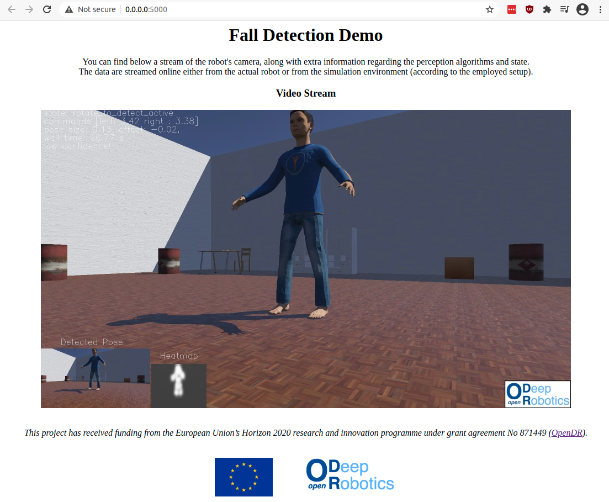

# Fall Detection using Lightweight OpenPose

This project provides a demo developed on Webots to demonstrate how OpenDR functionality can be used to provide a naive fall detector. 
This demo can be also directly used on an NVIDIA [JetBot](https://github.com/NVIDIA-AI-IOT/jetbot).

## Instructions
1. Install the additional requirements by running `pip3 install -r requirements.txt`.
   If you use obstacle detection/avoidance, please also install the appropriate version of [mxnet](https://mxnet.apache.org).
2. Run either the `evaluate.sh` (for evaluation using Webots) or `jetbot.sh` (to run the demo on JetBot).

To run the evaluation on your computer using Webots, please start the world contained in the project directory `simulation_pose`. 
Then you can run different evaluation by running `evaluate.sh`. 
You can switch between different setups (three supported) using the `--setup` flag, you can record the simulation output in a file using the `--video` flag, you can enable the OpenDR acceleration mode using the `--opendr` flag, you can turn on the active perception mode (experimental) using the `--active` flag, while you can switch off the basic RGB mono obstacle avoidance using the `--nocollision` flag. 
The implementation also exposes a flask-based web interface for monitoring, which can be enabled using the `--web` flag (see below). 
Using the `--local` flag provides an OpenCV window for monitoring the input to the DNN, as well as providing other useful information.

To run the evaluation on jetbot you can simply use the `jetbot.sh`. 
Note that collision avoidance is not supported on JetBot due to the limited computational resources. 
Furthermore, you should make sure that the camera is facing upwards. 
Based on the actual configuration and calibration of you robot, you might need to finetune the default parameters set in [pose_controller.py](https://github.com/cidl-auth/fall_detection_demo/blob/main/utils/pose_controller.py#L87). 
The demo controller attempts to stop the JetBot motors if an exception is raised.
However, if this fails, then you can use the `jetbot_kill.sh` for convenience. 
Note that the response time of the script might be high, if the JetBot is loaded.

## Monitoring progress remotely
Setting the ``--web`` flag allows for monitoring the stream from the web browser (this is expected to be useful when the demo will be running on JetBot). 
You can access the interface at `localhost:5000`. 
The server also responds to connections from other machines.

