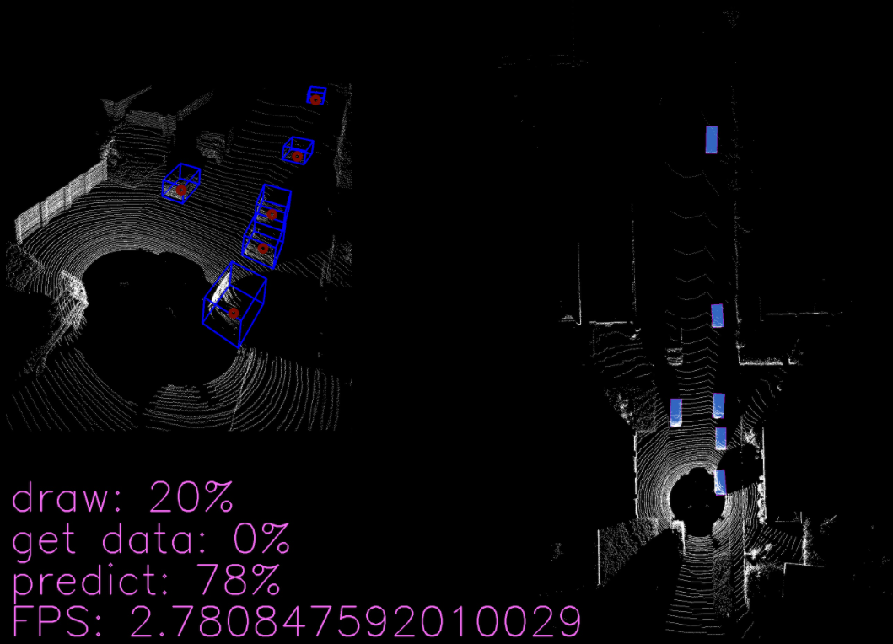

# OpenDR object detection 3d demo
<div align="left">
  <a href="https://opensource.org/licenses/Apache-2.0">
    
  </a>
</div>

Live demo of 3D object detection using the [OpenDR toolkit](https://opendr.eu).
It captures the point cloud stream from either a disk, O3D Lidar or RPLidar, performs frame-by-frame predictions, and presents the results on a web UI.


## Set-up
After setting up the _OpenDR toolkit_, install dependencies of this demo by navigating to this folder and run:
```bash
pip install -e .
```


## Running the example
Car 3D Object Detection using [TANet](https://arxiv.org/abs/1912.05163) from [KITTI](http://www.cvlibs.net/datasets/kitti/eval_object.php?obj_benchmark=3d)-like dataset
```bash
python3 demo.py --ip=0.0.0.0 --port=2605 --algorithm=voxel --model_name=tanet_car_xyres_16 --source=disk --data_path=/data/sets/kitti_tracking/training/velodyne/0000 --model_config=configs/tanet_car_xyres_16.proto
```

Car 3D Object Detection using [PointPillars](https://arxiv.org/abs/1812.05784) from [KITTI](http://www.cvlibs.net/datasets/kitti/eval_object.php?obj_benchmark=3d)-like dataset
```bash
python3 demo.py --ip=0.0.0.0 --port=2605 --algorithm=voxel --model_name=pointpillars_car_xyres_16 --source=disk --data_path=/data/sets/kitti_tracking/training/velodyne/0000 --model_config=configs/pointpillars_car_xyres_16.proto
```

3D Object Detection using a specially trained model X for O3M Lidar
```bash
python3 demo.py --ip=0.0.0.0 --port=2605 --algorithm=voxel --model_name=X --source=o3mlidar --o3m_ip=0.0.0.0 --o3m_port=42000 --o3m_buffer_size=1460
```


3D Object Detection using a specially trained model X for RPLidar
```bash
python3 demo.py --ip=0.0.0.0 --port=2605 --algorithm=voxel --model_name=X --source=rplidar --rplidar_port=/dev/ttyUSB0
```

If you run camera demo and navigate to http://0.0.0.0:2605, you might see something like this:



For other options, see `python3 demo.py --help`

## Acknowledgement
This work has received funding from the European Union’s Horizon 2020 research and innovation programme under grant agreement No 871449 (OpenDR). This publication reflects the authors’ views only. The European Commission is not responsible for any use that may be made of the information it contains.
