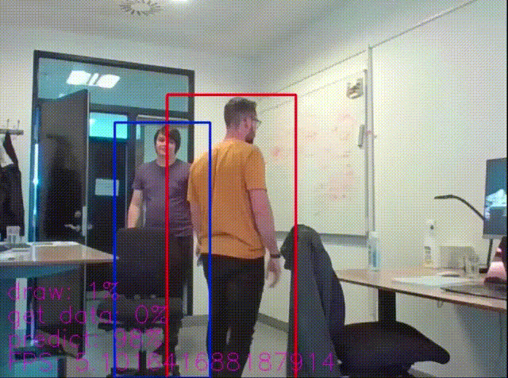

# OpenDR object tracking 2d demo
<div align="left">
  <a href="https://opensource.org/licenses/Apache-2.0">
    
  </a>
</div>

Live demo of 2D object tracking using the [OpenDR toolkit](https://opendr.eu).
It captures the video stream from either a camera or disk, performs frame-by-frame predictions, and presents the results on a web UI.


## Set-up
After setting up the _OpenDR toolkit_, install dependencies of this demo by navigating to this folder and run:
```bash
pip install -e .
```


## Running the example
Human 2D Object Tracking using [FairMOT](https://arxiv.org/abs/2004.01888) from camera
```bash
python3 demo.py --ip=0.0.0.0 --port=2605 --algorithm=fair_mot --model_name=fairmot_dla34 --source=camera
```

Human 2D Object Tracking using [FairMOT](https://arxiv.org/abs/2004.01888) from [MOT](https://motchallenge.net/)-like dataset on disk (data and splits pathes should be changed to your dataset folders)
```bash
python3 demo.py --ip=0.0.0.0 --port=2605 --algorithm=fair_mot --model_name=fairmot_dla34 --source=disk --data_path=/data/sets/MOT/MOT2020/ --data_splits=/data/sets/MOT/splits/mot20.train
```

Human 2D Object Tracking using [DeepSort](https://arxiv.org/abs/1703.07402) from [MOT](https://motchallenge.net/)-like dataset on disk (data and splits pathes should be changed to your dataset folders)
```bash
python3 demo.py --ip=0.0.0.0 --port=2605 --algorithm=deep_sort --model_name=deep_sort --source=disk --data_path=/data/sets/MOT/MOT2020/ --data_splits=/data/sets/MOT/splits/mot20.train
```

If you run camera demo and navigate to http://0.0.0.0:2605, you might see something like this:



For other options, see `python3 demo.py --help`


## Troubleshooting
If no video is displayed, you may try to select another video source using the `--video_source` flag:
```bash
python3 demo.py --ip=0.0.0.0 --port=2605 --algorithm=fair_mot --model_name=fairmot_dla34 --source=camera --video_source 1
```

## Acknowledgement
This work has received funding from the European Union’s Horizon 2020 research and innovation programme under grant agreement No 871449 (OpenDR). This publication reflects the authors’ views only. The European Commission is not responsible for any use that may be made of the information it contains.
