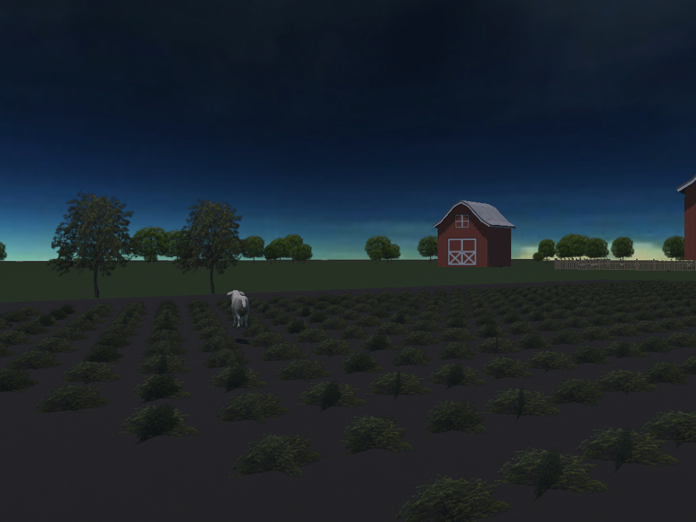
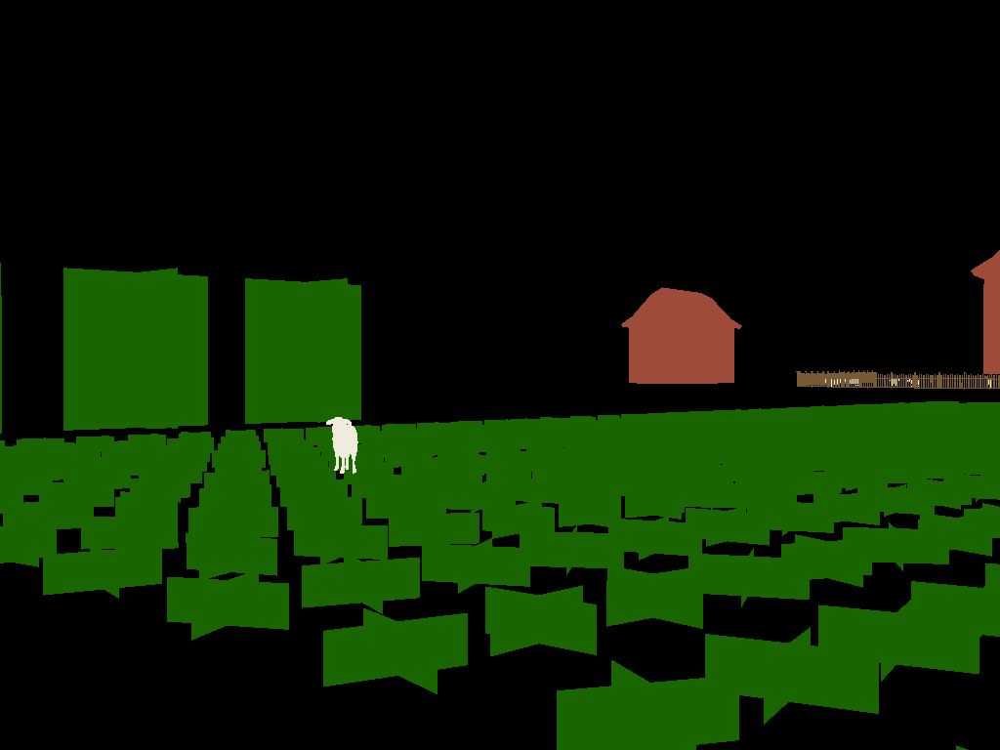
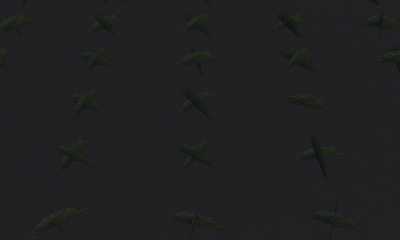
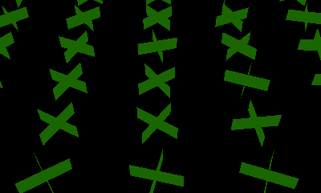
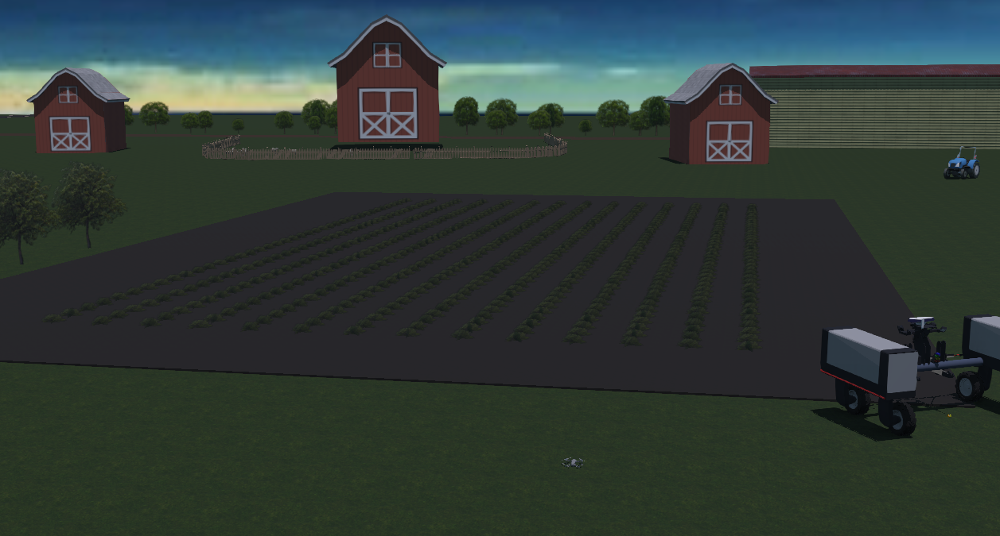
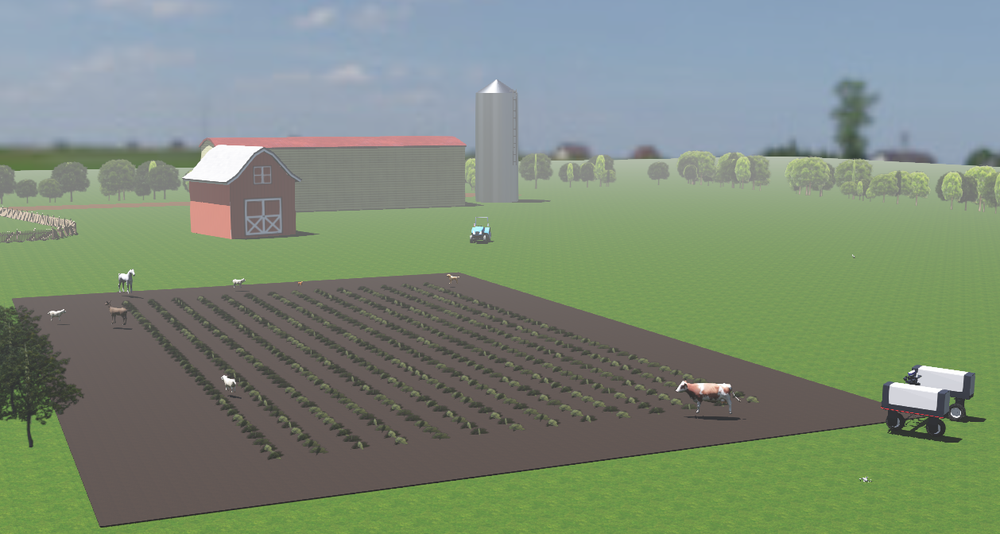

# Agricultural Simulation Dataset Generator
This folder contains source for:
- Generating agriculatural simulation dataset using a Webots simulator environment.
- A python script for loading, viewing and using the generated datasets.

<p float="left">
  
  
</p>
<p float="left">
  
  
</p>

# How to use
To use and generate the datasets open the Webots world file ./agricultural-environment-robotti-mavicpro/worlds/agricultural-environment-robotti-mavicpro.wbt using Webots version from this link: https://github.com/cyberbotics/webots/releases/tag/CameraRecognition

# Dataset structure
Each dataset comprises of simultaneous data gathered from a UGV and a UAV.
The folder hierarchy for UGV looks like this:
```
├─ UGV
|  ├─ annotations
|     └─ front_bottom_camera
|  ├─ front_bottom_camera
|  ├─ Hemisphere_v500
|  ├─ imu_robotti
|  └─ velodyne 
```
The folder hierarchy for UAV looks like this:
```
├─ UAV
|  ├─ annotations
|     └─ camera
|  ├─ camera
|  ├─ Hemisphere_v500
|  ├─ imu_mavicpro
|  └─ gps 
```

# Simulation Scenarios
<p float="left">
  
  
</p>
By changing the variables defined in ./agricultural-environment-robotti-mavicpro/controllers/generate_robotti_obstacles_datasets/generate_robotti_obstacles_datasets.py it is possible to change the simulation scenarios. 

The following parametrs would change a scenario:
- Changing the lighting condition using **backgrounds** variable.
- Changing the weather condition by adding fog using **enable_fog** variable

# Simulation Parameters
In order to manage the dataset location, length, and obstacles use the following parameters defined in ./agricultural-environment-robotti-mavicpro/controllers/generate_robotti_obstacles_datasets/generate_robotti_obstacles_datasets.py:
- **DATASET_NAME**: to set the location of the dataset for UGV (robotti)
- **OBSTACLES_PER_SCENARIO**: The number of obstacles (including animal and human) in the scenario
- **STOP_ON**: To set max second the script gathers the data for dataset.

# Loading, viewing, and using the dataset
By using the python file ./dataset_viewer.py it is possible to load and view the dataset. **path_ugv** and **path_uav** should be set to the desired dataset folder. 
