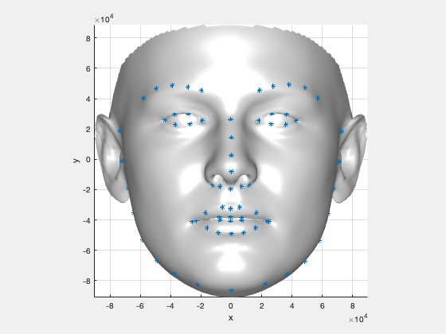

The original version with neck:

  

[bfm.ply](https://github.com/Hangz-nju-cuhk/Rotate-and-Render/blob/master/3ddfa/BFM_Remove_Neck/bfm.ply)

The image is rendered by MeshLab.

`bfm_show.m` shows how to render it with 68 keypoints in Matlab.

  

Attention: Do not use the `ply` file in training.
