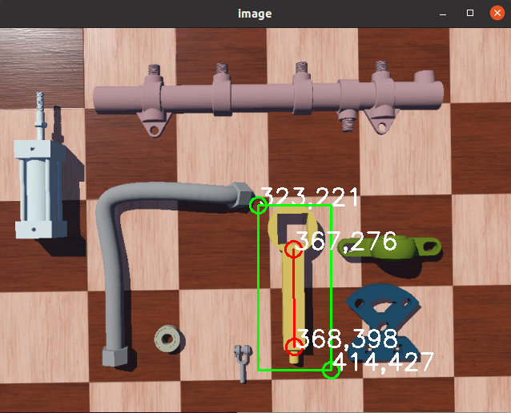

# Single Demonstration Grasping Data Augmentor

This folder contains a simple data augmentor for single demonstration grasping training.

## Example

To generate data, put the reference image in augmentation folder, then:

```
python3 augmentation_gui.py
```

and follow the instructions in terminal to select bounding box and two keypoint as illustrated in the figure.


